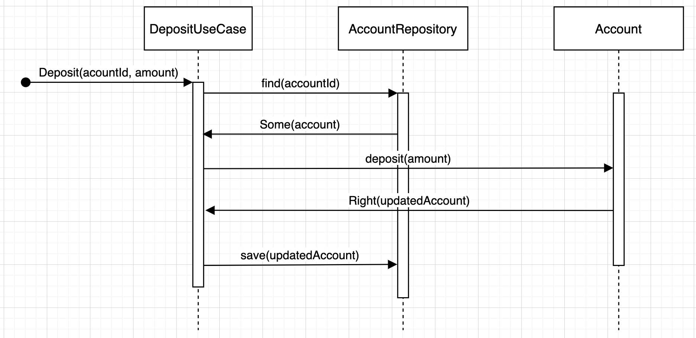

## Deposit
Let's think about test cases for the deposit:
```text
Not existing account -> return a failure "Unknown account"
Existing account -> return a failure for a deposit of 0
Existing account & a deposit of 1000 -> store the updated account containing a positive transaction of 1000 
```

Passing Sequence:


Let's create a new test class `DepositShould`

### Non-passing tests
Based on our sequence diagram, we can design the test by knowing what we will need to make it pass.
One question is remaining which return type do we want to use on `invoke`?

> Let's use an Either[String, Account]

:red_circle: Let's write our first test
```scala
class DepositShould extends AnyFlatSpec with MockFactory with EitherValues with Matchers {

    it should "return a failure for a non existing account" in {
      val deposit = Deposit(UUID.randomUUID(), 1000)
      val depositUseCase = new DepositUseCase(accountRepositoryStub)
  
      (accountRepositoryStub.find _)
        .when(deposit.accountId)
        .returns(None)
  
      depositUseCase.invoke(deposit).left.get mustBe "Unknown account"
    }
}
```

Instantiate a stub for the repository and create a trait for it.

```scala
private val accountRepositoryStub = stub[AccountRepository]

// under the domain -> check hexagonal architecture (ports and adapters)
trait AccountRepository {
  def find(accountId: UUID): Option[Account]
}
```

Generate an `Account` class in the package `banking.domain`

```scala
case class Account(id: UUID) {}
```

Adapt the `Use Case`:
- Inject the repository
- Change the `invoke` return type -> `Either[String, Account]`

```scala
class DepositUseCase(accountRepository: AccountRepository) {
  def invoke(deposit: Deposit): Either[String, Account] = ???
}
```

:green_circle: Make it green as fast as possible
```scala
def invoke(deposit: Deposit): Either[String, Account] = Left("Unknown account")
```

```text
✅ Not existing account -> return a failure "Unknown account"
Existing account -> return a failure for a deposit of 0
Existing account & a deposit of 1000 -> store the updated account containing a positive transaction of 1000 
```

:large_blue_circle: Do you think any refactoring could be made ?

:red_circle: Add a second non-passing test (Existing account -> return a failure for a deposit of 0)
- We need to instantiate an existing `Account`
- Simulate it can be found from the `db`
- Then assert that for the given amount it returns an error

```scala
  it should "return a failure for an existing account and a deposit of 0" in {
    val deposit = Deposit(UUID.randomUUID(), 0)
    val depositUseCase = new DepositUseCase(accountRepositoryStub)

    (accountRepositoryStub.find _)
      .when(deposit.accountId)
      .returns(Some(Account(deposit.accountId)))

    depositUseCase.invoke(deposit).left.get mustBe "Invalid amount for deposit"
  }
```

:green_circle: Make it green as fast as possible
```scala
class DepositUseCase(accountRepository: AccountRepository) {
  def invoke(deposit: Deposit): Either[String, Account] =
    accountRepository.find(deposit.accountId) match {
      case Some(account) => Left("Invalid amount for deposit")
      case None          => Left("Unknown account")
    }
}
```

```text
✅ Not existing account -> return a failure "Unknown account"
✅ Existing account -> return a failure for a deposit of 0
Existing account & a deposit of 1000 -> store the updated account containing a positive transaction of 1000 
```

:large_blue_circle: We already have some duplication in our Use Case tests and we can improve readability as well
```scala
class DepositShould extends AnyFlatSpec with MockFactory with EitherValues with Matchers {
  private val accountRepositoryStub = stub[AccountRepository]
  private val anAccountId = UUID.randomUUID()
  private val depositUseCase = new DepositUseCase(accountRepositoryStub)

  it should "return a failure for a non existing account" in {
    val deposit = Deposit(anAccountId, 1000)
    notExistingAccount()

    depositUseCase.invoke(deposit).left.get mustBe "Unknown account"
  }

  it should "return a failure for an existing account and a deposit of 0" in {
    val invalidDeposit = Deposit(anAccountId, 0)
    existingAccount()

    depositUseCase.invoke(invalidDeposit).left.get mustBe "Invalid amount for deposit"
  }

  private def notExistingAccount(): Unit =
    (accountRepositoryStub.find _)
      .when(anAccountId)
      .returns(None)

  private def existingAccount(): Unit =
    (accountRepositoryStub.find _)
      .when(anAccountId)
      .returns(Some(Account(anAccountId)))
}
```

### Passing test(s)
:red_circle: Let's write a passing test now (Existing account & a deposit of 1000)
Verify that the updatedAccount is saved through our `AccountRepository` with expected transaction

What is a `Transaction`, it is a business concept that should be represented in our domain...

```scala
  it should "store the updated account containing a Transaction(transactionTime, 1000) for an existing account and a deposit of 1000" in {
    val deposit = Deposit(anAccountId, 1000)
    existingAccount()

    val newAccount = depositUseCase.invoke(deposit)

    newAccount.right.value.transactions must contain(Transaction(transactionTime, 1000))
    (accountRepositoryStub.save _)
      .verify(newAccount.right.value)
      .once()
  }
```

:green_circle: Let's iterate on our code to make it green

First, we need to create a `Transaction` Value Object
```scala
case class Transaction(at: LocalDateTime, amount: Double) {}
```

Then, we need to adapt our `DepositUseCase` constructor (we need to pass a `Clock`)
```scala
trait Clock {
  def now(): LocalDateTime
}

class DepositUseCase(accountRepository: AccountRepository, clock: Clock) {
  def invoke(deposit: Deposit): Either[String, Account] =
    accountRepository.find(deposit.accountId) match {
      case Some(account) => Left("Invalid amount for deposit")
      case None          => Left("Unknown account")
    }
}
```

We adapt the Use Case to delegate the deposit logic to the `domain` and save the `result` in case of `Right`
```scala
class DepositUseCase(accountRepository: AccountRepository, clock: Clock) {
  def invoke(deposit: Deposit): Either[String, Account] = {
    accountRepository.find(deposit.accountId) match {
      case Some(account) =>
        account.deposit(clock, deposit.amount) match {
          case Right(updatedAccount) =>
            accountRepository.save(updatedAccount)
            Right(updatedAccount)
          case Left(error) => Left(error)
        }
      case None => Left("Unknown account")
    }
  }
}
```

Let's implement the `deposit` in `Account`
```scala
case class Account(id: UUID, transactions: List[Transaction] = List()) {

  def deposit(clock: Clock, amount: Double): Either[String, Account] = {
    if (amount <= 0) Left("Invalid amount for deposit")
    else Right(copy(transactions = List(Transaction(clock.now(), amount))))
  }
}
```

Let's simulate the behavior of the `Clock` to make our test green
```scala
private val transactionTime: LocalDateTime = LocalDateTime.of(2022, 8, 19, 13, 0)
private val clockStub: Clock = stub[Clock]
(clockStub.now _).when().returns(transactionTime)
```

We have a problem with `scalamock`, if we want to reuse stubs between tests in isolation we have to use the trait `OneInstancePerTest` 
Let's check the documentation [here](https://scalamock.org/user-guide/sharing-scalatest/)

```text
✅ Not existing account -> return a failure "Unknown account"
✅ Existing account -> return a failure for a deposit of 0
✅ Existing account & a deposit of 1000 -> store the updated account containing a positive transaction of 1000 
```

:large_blue_circle: We have some potential improvement in both tests and production code

- We rename some variables
- Create a class to hide instantiation of `LocalDateTime`
- Reuse the valid deposit

```scala
class DepositShould
    extends AnyFlatSpec
    with MockFactory
    with EitherValues
    with Matchers
    with OneInstancePerTest {
  private val accountRepositoryStub = stub[AccountRepository]

  private val transactionTime: LocalDateTime = aLocalDateTime
  private val clockStub: Clock = stub[Clock]
  (clockStub.now _).when().returns(transactionTime)

  private val anAccountId = UUID.randomUUID()
  private val depositOf1000 = Deposit(anAccountId, 1000)
  private val depositUseCase = new DepositUseCase(accountRepositoryStub, clockStub)

  it should "return a failure for a non existing account" in {
    notExistingAccount()
    depositUseCase.invoke(depositOf1000).left.get mustBe "Unknown account"
  }

  it should "return a failure for an existing account and a deposit of 0" in {
    val invalidDeposit = Deposit(anAccountId, 0)
    existingAccount()

    depositUseCase.invoke(invalidDeposit).left.get mustBe "Invalid amount for deposit"
  }

  it should "store the updated account containing a Transaction(transactionTime, 1000) for an existing account and a deposit of 1000" in {
    existingAccount()

    val newAccount = depositUseCase.invoke(depositOf1000)

    newAccount.right.value.transactions must contain(Transaction(transactionTime, 1000))
    (accountRepositoryStub.save _)
      .verify(newAccount.right.value)
      .once()
  }

  private def notExistingAccount(): Unit =
    (accountRepositoryStub.find _)
      .when(anAccountId)
      .returns(None)

  private def existingAccount(): Unit =
    (accountRepositoryStub.find _)
      .when(anAccountId)
      .returns(Some(Account(anAccountId)))
}
```

In the `DepositUseCase` we extract the `depositSafely` method to reduce complexity
```scala
class DepositUseCase(accountRepository: AccountRepository, clock: Clock) {
  def invoke(deposit: Deposit): Either[String, Account] = {
    accountRepository.find(deposit.accountId) match {
      case Some(account) => depositSafely(deposit, account)
      case None          => Left("Unknown account")
    }
  }

  private def depositSafely(deposit: Deposit, account: Account): Either[String, Account] =
    account.deposit(clock, deposit.amount) match {
      case Right(updatedAccount) =>
        accountRepository.save(updatedAccount)
        Right(updatedAccount)
      case Left(error) => Left(error)
    }
}
```

> We have implemented all the identified test cases, what is the next step?

### Improve our confidence
At this point, at least 2 other key examples pop in my head:
- What happens if an `Account` already contains a `Transaction`?
- We have tested the non-passing case of a deposit with an amount of 0, what happens for a negative amount?

```text
✅ Not existing account -> return a failure "Unknown account"
✅ Existing account -> return a failure for a deposit of 0
✅ Existing account & a deposit of 1000 -> store the updated account containing a positive transaction of 1000 
Existing account containing already a Transaction(09/10/1987, -200) & a deposit of 1000 -> store the updated account containing a positive transaction of 1000 and the former transaction
Existing account -> return a failure for a deposit of -1
```

:red_circle: Let's write our new example
```scala
  it should "store the updated account containing a Transaction(transactionTime, 1000) for an existing account containing already a Transaction(09/10/1987, -200) and a deposit of 1000" in {
    val anExistingTransaction = Transaction(LocalDateTime.of(1987, 10, 9, 23, 0), -200)
    val existingAccount = Account(anAccountId, List(anExistingTransaction))

    (accountRepositoryStub.find _)
      .when(anAccountId)
      .returns(Some(existingAccount))

    val newAccount = depositUseCase.invoke(depositOf1000)

    newAccount.right.value.transactions mustBe List(
      Transaction(transactionTime, 1000),
      anExistingTransaction
    )

    (accountRepositoryStub.save _)
      .verify(newAccount.right.value)
      .once()
  }
```

:green_circle: Adapt our `Account` to support this key example
```scala
case class Account(id: UUID, transactions: List[Transaction] = List()) {

  def deposit(clock: Clock, amount: Double): Either[String, Account] = {
    if (amount <= 0) Left("Invalid amount for deposit")
    else Right(copy(transactions = Transaction(clock.now(), amount) :: transactions))
  }
}
```

```text
✅ Not existing account -> return a failure "Unknown account"
✅ Existing account -> return a failure for a deposit of 0
✅ Existing account & a deposit of 1000 -> store the updated account containing a positive transaction of 1000 
✅ Existing account containing already a Transaction(09/10/1987, -200) & a deposit of 1000 -> store the updated account containing a positive transaction of 1000 and the former transaction
Existing account -> return a failure for a deposit of -1
```

:large_blue_circle: Improve the tests and use `Test Data Builders` for our `domain` objects (it will make further refactoring easiest)

```scala
class DepositShould
    extends AnyFlatSpec
    with MockFactory
    with EitherValues
    with Matchers
    with OneInstancePerTest {
  private val anAccountId = UUID.randomUUID()
  private val transactionTime: LocalDateTime = aLocalDateTime
  private val depositOf1000 = Deposit(anAccountId, 1000)

  private val accountRepositoryStub = stub[AccountRepository]
  private val clockStub: Clock = stub[Clock]
  (clockStub.now _).when().returns(transactionTime)

  private val depositUseCase = new DepositUseCase(accountRepositoryStub, clockStub)

  it should "return a failure for a non existing account" in {
    notExistingAccount()
    depositUseCase.invoke(depositOf1000).left.get mustBe "Unknown account"
  }

  it should "return a failure for an existing account and a deposit of 0" in {
    val invalidDeposit = Deposit(anAccountId, 0)
    existingAccount()

    depositUseCase.invoke(invalidDeposit).left.get mustBe "Invalid amount for deposit"
  }

  it should "store the updated account containing a Transaction(transactionTime, 1000) for an existing account and a deposit of 1000" in {
    existingAccount()
    val newAccount = depositUseCase.invoke(depositOf1000)

    assertAccountHasBeenCorrectlyUpdated(newAccount, List(Transaction(transactionTime, 1000)))
  }

  it should "store the updated account containing a Transaction(transactionTime, 1000) for an existing account containing already a Transaction(09/10/1987, -200) and a deposit of 1000" in {
    val anExistingTransaction = aNewTransaction()
      .madeAt(anotherDateTime)
      .of(-200)
      .build()

    existingAccount(anExistingTransaction)

    val newAccount = depositUseCase.invoke(depositOf1000)

    assertAccountHasBeenCorrectlyUpdated(
      newAccount,
      List(
        Transaction(transactionTime, 1000),
        anExistingTransaction
      )
    )
  }

  private def notExistingAccount(): Unit =
    (accountRepositoryStub.find _)
      .when(anAccountId)
      .returns(None)

  private def existingAccount(transactions: Transaction*): Unit =
    (accountRepositoryStub.find _)
      .when(anAccountId)
      .returns(
        Some(
          AccountBuilder
            .aNewAccount(anAccountId)
            .containing(transactions.toList)
            .build()
        )
      )

  private def assertAccountHasBeenCorrectlyUpdated(
      newAccount: Either[String, Account],
      expectedTransactions: List[Transaction]
  ): Unit = {
    newAccount.right.value.transactions mustBe expectedTransactions
    (accountRepositoryStub.save _)
      .verify(newAccount.right.value)
      .once()
  }
}
```

Here are the 2 builders
```scala
class AccountBuilder(private val accountId: UUID) {
  private var transactions: List[Transaction] = Nil

  def containing(transactions: List[Transaction]): AccountBuilder = {
    this.transactions = transactions
    this
  }

  def build(): Account = Account(accountId, transactions)
}

object AccountBuilder {
  def aNewAccount(accountId: UUID = UUID.randomUUID()): AccountBuilder =
    new AccountBuilder(accountId)
}

class TransactionBuilder {
  private var at = anotherDateTime
  private var amount = 1000d

  def madeAt(at: LocalDateTime): TransactionBuilder = {
    this.at = at
    this
  }

  def of(amount: Double): TransactionBuilder = {
    this.amount = amount
    this
  }

  def build(): Transaction = Transaction(at, amount)
}

object TransactionBuilder {
  def aNewTransaction(): TransactionBuilder = new TransactionBuilder()
}
```


// CONTINUER ICI