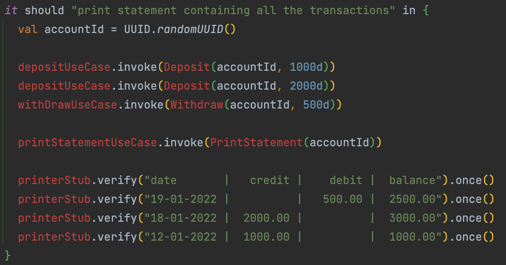
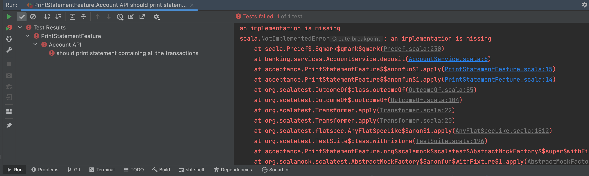

## Add an Acceptance Test
- Add a package `acceptance` under test
- Create a test class `PrintStatementFeature`

```scala
class PrintStatementFeature extends AnyFlatSpec {
  behavior of "Account API"

  it should "print statement containing all the transactions" in {}
}
```

- Create the necessary objects from this acceptance test
- We choose to design 1 `Use Case` for each business behavior
  - Instead of having `all-in-one` services

```scala
  it should "print statement containing all the transactions" in {
    val accountId = UUID.randomUUID()

    depositUseCase.invoke(Deposit(accountId, 1000d))
    depositUseCase.invoke(Deposit(accountId, 2000d))
    withDrawUseCase.invoke(Withdraw(accountId, 500d))

    printStatementUseCase.invoke(PrintStatement(accountId))

    printerStub.verify("date       |   credit |    debit |  balance").once()
    printerStub.verify("19-01-2022 |          |   500.00 |  2500.00").once()
    printerStub.verify("18-01-2022 |  2000.00 |          |  3000.00").once()
    printerStub.verify("12-01-2022 |  1000.00 |          |  1000.00").once()
  }
```

- From here, we can generate the necessary objects to compile this code



- Generate the related commands inside a `banking.commands` package
```scala
case class Deposit(accountId: UUID, amount: Double) {}
case class PrintStatement(accountId: UUID) {}
case class Withdraw(accountId: UUID, amount: Double) {}
```

- Generate the Use Cases inside a `banking.usecases` package

```scala
class DepositUseCase() {
  def invoke(deposit: Deposit) = ???
}

class PrintStatementUseCase(printer: String => Unit) {
  def invoke(statement: PrintStatement) = ???
}

class WithdrawUseCase() {
  def invoke(withdraw: Withdraw) = ???
}
``` 

- Instantiate a `stub` function for our test

```scala
class PrintStatementFeature extends AnyFlatSpec with Matchers with MockFactory {
  behavior of "Account API"

  private val printerStub = stubFunction[String, Unit]

  private val depositUseCase = new DepositUseCase()
  private val withDrawUseCase = new WithdrawUseCase()
  private val printStatementUseCase = new PrintStatementUseCase(printerStub)

  it should "print statement containing all the transactions" in {
    val accountId = UUID.randomUUID()

    depositUseCase.invoke(Deposit(accountId, 1000d))
    depositUseCase.invoke(commands.Deposit(accountId, 2000d))
    withDrawUseCase.invoke(Withdraw(accountId, 500d))

    printStatementUseCase.invoke(PrintStatement(accountId))

    printerStub.verify("date       |   credit |    debit |  balance").once()
    printerStub.verify("19-01-2022 |          |   500.00 |  2500.00").once()
    printerStub.verify("18-01-2022 |  2000.00 |          |  3000.00").once()
    printerStub.verify("12-01-2022 |  1000.00 |          |  1000.00").once()
  }
}
```

- Let's improve our test ta take into account the order in which the printer should be called
    - We can use the `inSequence` method from `scalamock` for that
```scala
inSequence {
  printerStub.verify("date       |   credit |    debit |  balance").once()
  printerStub.verify("19-01-2022 |          |   500.00 |  2500.00").once()
  printerStub.verify("18-01-2022 |  2000.00 |          |  3000.00").once()
  printerStub.verify("12-01-2022 |  1000.00 |          |  1000.00").once()
}
```

Congrats, you have a failing acceptance test that we will use as an `implementation driver`



## TDD Loops
Go down to the Unit Level and work on the `AccountService`

> What is the responsibility of this class?

- Fetch a database to identify if the `account` exists in the system
  - If so, delegate the business logic to the `domain` entity then `store` the new state
  - If no, return a failure

Here, 3 business behaviors are clearly identified on the `Service`. Let's work on them.

### Deposit
Let's think about test cases for the deposit:
```text
- Not existing account -> return a failure
- Existing account -> store the update account 
```

