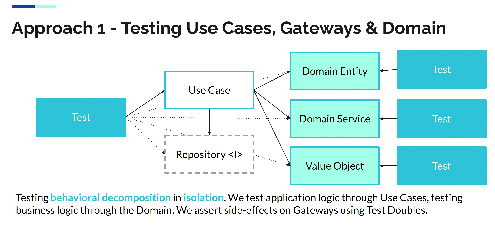
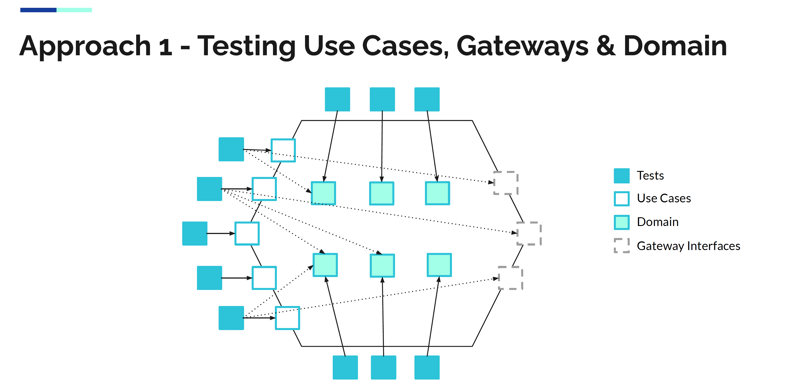
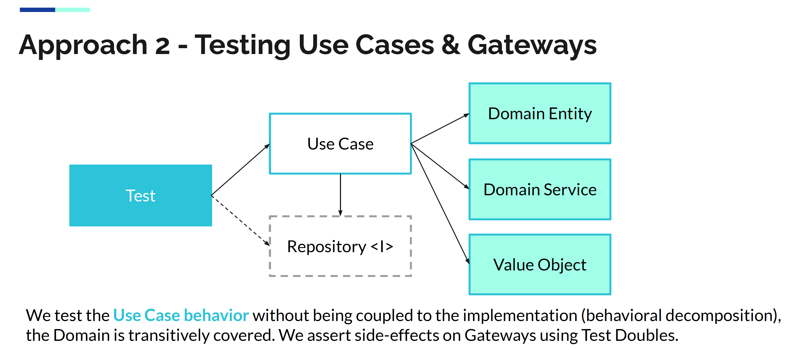
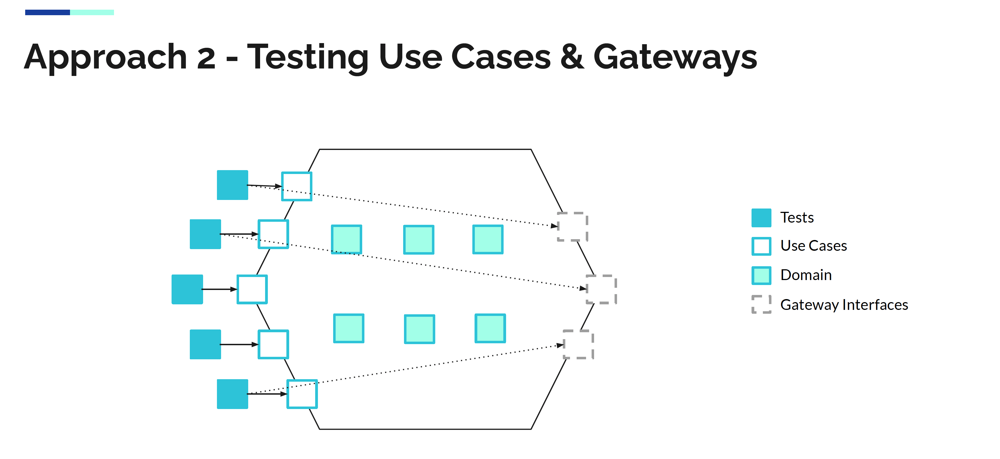
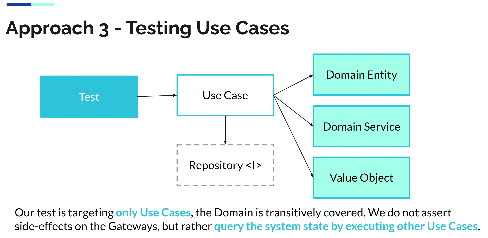
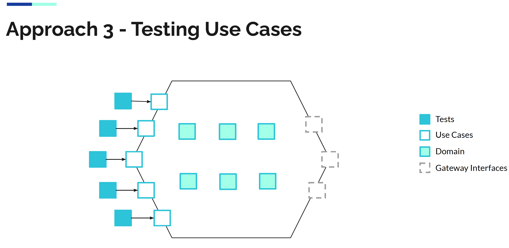

## Add an Acceptance Test
- Add a package `acceptance` under test
- Create a test class `PrintStatementFeature`

```scala
class PrintStatementFeature extends AnyFlatSpec {
  behavior of "Account API"

  it should "print statement containing all the transactions" in {}
}
```

:red_circle: let's create our acceptance test based on the business scenario

```scala
  it should "print statement containing all the transactions" in {
    val accountId = UUID.randomUUID()

    depositUseCase.invoke(Deposit(accountId, 1000d))
    depositUseCase.invoke(Deposit(accountId, 2000d))
    withDrawUseCase.invoke(Withdraw(accountId, 500d))

    printStatementUseCase.invoke(PrintStatement(accountId))

    printerStub.verify("date       |   credit |    debit |  balance").once()
    printerStub.verify("19-01-2022 |          |   500.00 |  2500.00").once()
    printerStub.verify("18-01-2022 |  2000.00 |          |  3000.00").once()
    printerStub.verify("12-01-2022 |  1000.00 |          |  1000.00").once()
  }
```
- From here, we can generate the necessary objects to compile this code
- We choose to design 1 `Use Case` for each business behavior
  - Instead of having `all-in-one` services


- Generate the related commands inside a `banking.commands` package
```scala
case class Deposit(accountId: UUID, amount: Double) {}
case class PrintStatement(accountId: UUID) {}
case class Withdraw(accountId: UUID, amount: Double) {}
```

- Generate the Use Cases inside a `banking.usecases` package

```scala
class DepositUseCase() {
  def invoke(deposit: Deposit) = ???
}

class PrintStatementUseCase(printer: String => Unit) {
  def invoke(statement: PrintStatement) = ???
}

class WithdrawUseCase() {
  def invoke(withdraw: Withdraw) = ???
}
``` 

- Instantiate a `stub` function for our test

```scala
class PrintStatementFeature extends AnyFlatSpec with Matchers with MockFactory {
  behavior of "Account API"

  private val printerStub = stubFunction[String, Unit]

  private val depositUseCase = new DepositUseCase()
  private val withDrawUseCase = new WithdrawUseCase()
  private val printStatementUseCase = new PrintStatementUseCase(printerStub)

  it should "print statement containing all the transactions" in {
    val accountId = UUID.randomUUID()

    depositUseCase.invoke(Deposit(accountId, 1000d))
    depositUseCase.invoke(commands.Deposit(accountId, 2000d))
    withDrawUseCase.invoke(Withdraw(accountId, 500d))

    printStatementUseCase.invoke(PrintStatement(accountId))

    printerStub.verify("date       |   credit |    debit |  balance").once()
    printerStub.verify("19-01-2022 |          |   500.00 |  2500.00").once()
    printerStub.verify("18-01-2022 |  2000.00 |          |  3000.00").once()
    printerStub.verify("12-01-2022 |  1000.00 |          |  1000.00").once()
  }
}
```

- Let's improve our test to take into account the order in which the printer should be called
    - We can use the `inSequence` method from `scalamock` for that
```scala
inSequence {
  printerStub.verify("date       |   credit |    debit |  balance").once()
  printerStub.verify("19-01-2022 |          |   500.00 |  2500.00").once()
  printerStub.verify("18-01-2022 |  2000.00 |          |  3000.00").once()
  printerStub.verify("12-01-2022 |  1000.00 |          |  1000.00").once()
}
```

Congrats, you have a failing acceptance test that we will use as an `implementation driver`


## TDD Loops
Go down to the Unit Level and work on a first `Use Case`

> What is the responsibility of the Use Case?

- Fetch a database to identify if the `account` exists in the system
  - If so, delegate the business logic to the `domain` entity then `store` the new state
  - If no, return a failure

### How to test "Use Cases"?
[](https://youtu.be/IZWLnn2fNko)

Several Options

#### Approach 1 - Testing Use Cases, Gateways & Domain




✅ Advantages
- Testing behavioral decomposition at the lowest level of granularity
- Useful for handling combinatorial explosion within the domain
- Useful for handling mathematically complex domains by testing interim steps

❌ Disadvantages
- We lose oversight of the use case requirements, need additional tests for the use case
- More test code, more expensive to write these tests and more expensive to maintain
- Tests are coupled to system implementation, sensitive to changes in behavioral decomposition and usage of design patterns, thus they are fragile and hinder refactoring

#### Approach 2 - Testing Use Cases & Gateways



✅ Advantages
- Targeting the API of the system (Use Cases & Gateways), not the implementation (Domain)
- Tests are readable as requirement specifications (main flows, exceptional flows)
- High coverage at a low cost - less test code, less expensive to write & maintain tests
- We can refactor system implementation, we can iteratively discover the domain and change behavioral decomposition without breaking the tests - high test robustness

❌ Disadvantages
- For use cases with behavioral combinatorial explosion and/or mathematical complexity, we may need to supplement these tests with more lower-level granular tests (“shifting gears”)

#### Approach 3 - Testing Use Cases



✅ Advantages
- Targeting the API of the system (Use Cases), not the implementation (Domain)
- Tests are readable as requirement specifications (main flows, exceptional flows)
- High coverage at a low cost - less test code, less expensive to write & maintain tests
- Highest test robustness because the tests are coupled only to Use Cases, nothing else

❌ Disadvantages
- Unable to verify side-effects on the Gateways in cases where such side-effects are not visible through Use Cases (e.g. the system sets some internal numbers or timestamps on entities updated to the repository, but not exposed through any query Use Cases)

#### Which one to choose?
In general, we recommend `unit testing Use Cases and Gateways` (**Approach 2**) because:
- Use Case tests are coupled to the system API, not the system implementation
- Use Case tests are readable as requirement specs, rather than implementation specs
- High coverage at low test maintenance costs, thus increasing ROI
- High test robustness, we can refactor the system safely without breaking tests

### Let's Unit Test
- [1. Deposit](docs/1.deposit.md)
- [2. Withdraw](docs/2.withdraw.md)