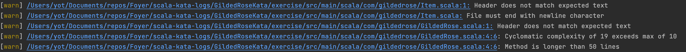
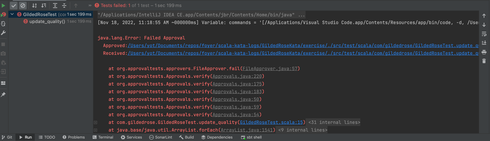
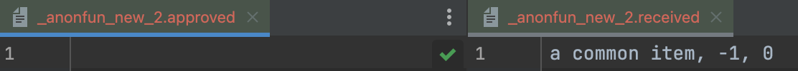
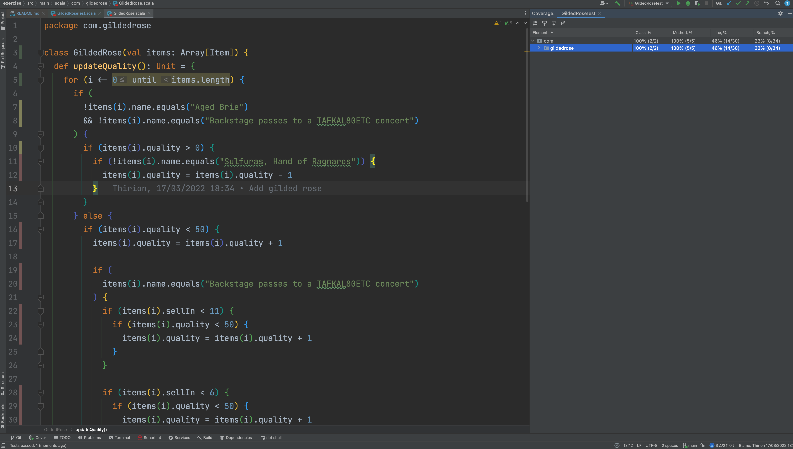
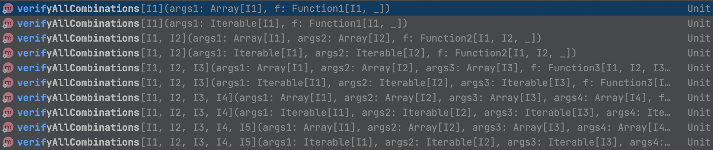
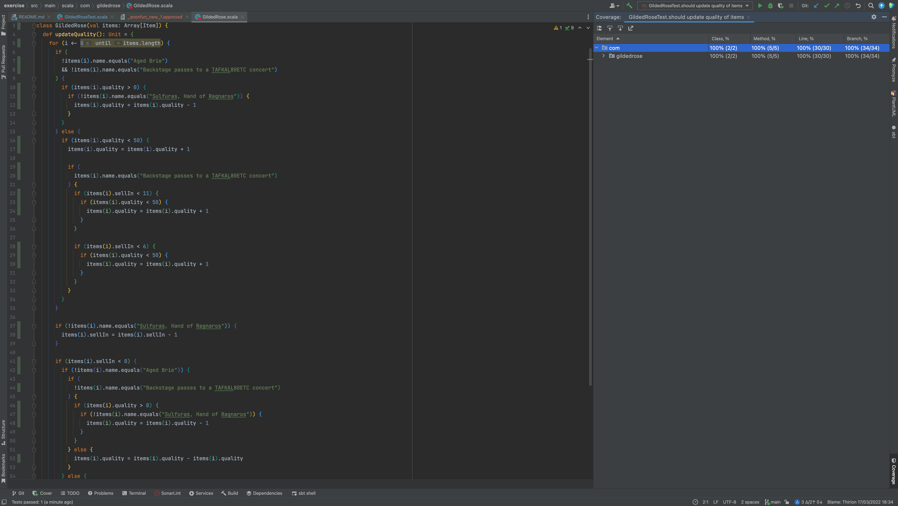
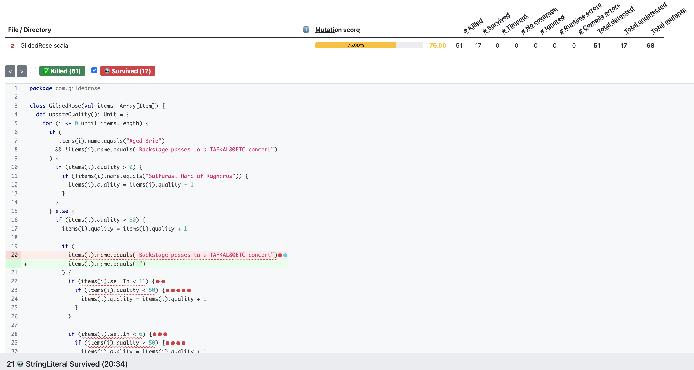
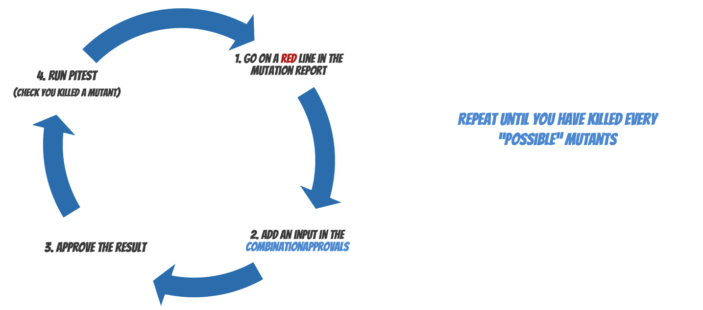

# Gilded Rose Kata
> Challenge for today : prepare a refactoring on the GildedRose class

This Kata was originally created by Terry Hughes (http://twitter.com/TerryHughes). 

It is already on GitHub [here](https://github.com/NotMyself/GildedRose). See also [Bobby Johnson's description of the kata](http://iamnotmyself.com/2011/02/13/refactor-this-the-gilded-rose-kata/).

## Learning Objectives
- Learn a practice that will help you be quickly productive in an unfamiliar environment
- Use `Approval Testing` to deal with legacy code


## Connection - Web hunt
In pair, take a look on the internet and find an answer to this question:
`What is approval testing?`
 


## Concepts
### What is Approval Testing ?
Approval Tests also called `Snapshot Tests` or `Golden Master`
- Work by creating an output that needs `human approval / verification`

Once the initial output has been defined and `APPROVED` then as long as the test provides consistent output then the test will continue to pass.

> Compare your implementation/actual program against approved outputs

Once the test provides output that is different to the approved output the test will fail. 

### The difference with Assert-based tests
- Unit testing asserts can be difficult to use
- Approval tests simplify this by taking a snapshot of the results
  - Confirming that they have not changed

```scala
person.age should be(26)
person.firstName should be("Freddy")
person.name should be("Krueger")
person.address should be(Address("Elm Street", "Springwood"))
...
As many asserts than you check data
```

With `Approval Testing`
```scala
Approvals.verify(person)
```

### Main characteristics
- Human `inspects and approves` some actual program output when creating a test case.
- Design a `Printer` (if necessary) to display complex objects, instead of many assertions.
- If actual program output is not yet available, the approved value may be a manual sketch of the expected output (useful when you do TDD).
- Approved values are `stored separately from the source code` for the test case


## Concrete Practice
### Preparation
Take some time to:
- Read the specifications below
- Take a look at the corresponding code

#### Specifications
Hi and welcome to team Gilded Rose. 
As you know, we are a small inn with a prime location in a prominent city ran by a friendly innkeeper named Allison. 
We also buy and sell only the finest goods. 

Unfortunately, our goods are constantly degrading in quality as they approach their sell by date.
We have a system in place that updates our inventory for us. It was developed by a no-nonsense type named Leeroy, who has moved on to new adventures. 

> Your task is to add the new feature to our system so that we can begin selling a new category of items. 

First an introduction to our system:
```text
- All items have a SellIn value which denotes the number of days we have to sell the item
- All items have a Quality value which denotes how valuable the item is
- At the end of each day our system lowers both values for every item
```

Pretty simple, right? Well this is where it gets interesting:
```text
- Once the sell by date has passed, Quality degrades twice as fast
- The Quality of an item is never negative
- "Aged Brie" actually increases in Quality the older it gets
- The Quality of an item is never more than 50
- "Sulfuras", being a legendary item, never has to be sold or decreases in Quality
- "Backstage passes", like aged brie, increases in Quality as its SellIn value approaches;
- Quality increases by 2 when there are 10 days or less and by 3 when there are 5 days or less but
- Quality drops to 0 after the concert
```

We have recently signed a supplier of conjured items. This requires an update to our system:
- "Conjured" items degrade in Quality twice as fast as normal items

> Feel free to make any changes to the UpdateQuality method and add any new code as long as everything still works correctly. 

However, do not alter the Item class or Items property as those belong to the goblin in the corner who will insta-rage and one-shot you as he doesn't believe in shared code ownership (you can make the UpdateQuality method and Items property static if you like, we'll cover for you).

Just for clarification, an item can never have its Quality increase above 50, however "Sulfuras" is a legendary item and as such its Quality is 80 and it never alters.

#### Your thoughts
- What do you think about this code ?
- If you must add a new type of items what would be your strategy ?


### Gather data
Let's use [`scalastyle`](http://www.scalastyle.org/sbt.html) to gather some data on this code.
To use it you need to add the plugin in the `plugins.sbt`:
```scala
addSbtPlugin("org.scalastyle" %% "scalastyle-sbt-plugin" % "1.0.0")
```

Then you must create a config file
```shell
sbt scalastyleGenerateConfig
```

After that you can run an analysis
```shell
sbt scalastyle
```

Here is the result of the analysis:


> updateQuality method has a cyclomatic complexity of 19...

#### A word on complexity


The associated code:
```scala
class GildedRose(val items: Array[Item]) {
  def updateQuality(): Unit = {
    for (i <- 0 until items.length) {
      if (
        !items(i).name.equals("Aged Brie")
        && !items(i).name.equals("Backstage passes to a TAFKAL80ETC concert")
      ) {
        if (items(i).quality > 0) {
          if (!items(i).name.equals("Sulfuras, Hand of Ragnaros")) {
            items(i).quality = items(i).quality - 1
          }
        }
      } else {
        if (items(i).quality < 50) {
          items(i).quality = items(i).quality + 1

          if (
            items(i).name.equals("Backstage passes to a TAFKAL80ETC concert")
          ) {
            if (items(i).sellIn < 11) {
              if (items(i).quality < 50) {
                items(i).quality = items(i).quality + 1
              }
            }

            if (items(i).sellIn < 6) {
              if (items(i).quality < 50) {
                items(i).quality = items(i).quality + 1
              }
            }
          }
        }
      }

      if (!items(i).name.equals("Sulfuras, Hand of Ragnaros")) {
        items(i).sellIn = items(i).sellIn - 1
      }

      if (items(i).sellIn < 0) {
        if (!items(i).name.equals("Aged Brie")) {
          if (
            !items(i).name.equals("Backstage passes to a TAFKAL80ETC concert")
          ) {
            if (items(i).quality > 0) {
              if (!items(i).name.equals("Sulfuras, Hand of Ragnaros")) {
                items(i).quality = items(i).quality - 1
              }
            }
          } else {
            items(i).quality = items(i).quality - items(i).quality
          }
        } else {
          if (items(i).quality < 50) {
            items(i).quality = items(i).quality + 1
          }
        }
      }
    }
  }
}
```

#### Refactoring
- How many tests would you write before being confident enough to refactor the code ?
- Which ones ?

### Let's do it
We have recently signed a supplier of conjured items. 
This requires an update to our system:
> "Conjured" items degrade in Quality twice as fast as normal items

#### Write a first test
Let's do it in baby steps.


:green_circle: Based on the specifications write a first test by using `scalatest`

```scala
  it should "update quality of a common item" in {
    val items = Array[Item] {
      new Item("a common item", 0, 0)
    }
    val gildedRose = new GildedRose(items)

    gildedRose.updateQuality()

    gildedRose.items(0).name should be("a common item")
    gildedRose.items(0).sellIn should be(-1)
    gildedRose.items(0).quality should be(0)
  }
```

#### Let's use an approval test now
We will use the [`ApprovalTests`](https://approvaltests.com/) for it.

We start by adding the dependency in our `build.sbt`
```scala
libraryDependencies += "com.github.writethemfirst" %% "approvals-scala" % "0.12.2" % "test"
```

:red_circle: Then we can use `verify` from our tests:
```scala
  it should "update quality of a common item with approval" in {
    val items = Array[Item] {
      new Item("a common item", 0, 0)
    }
    val gildedRose = new GildedRose(items)

    gildedRose.updateQuality()

    Approvals.verify(gildedRose.items(0))
  }
```

The test should `fail`


ApprovalTests library compares 2 files :
- `GildedRoseTest.files._anonfun_new_2.received` that has been generated based on what is inside the verify method call
- `GildedRoseTest.files._anonfun_new_2.approved` a content that has already been approved
  - Empty for now



The actual implementation is functionally good.
So we must `approve` what is currently generated / calculated by the system.

```shell
cat _anonfun_new_2.received > _anonfun_new_2.approved
```

Normally you should have file names corresponding to your test cases...

:green_circle: Run the test again.
The received file should have been deleted. You should never commit this kind of file.

> Tips: When you use approval testing you need to update your .gitignore file to ignore received files

```text
*.received
```

#### Code Coverage as a driver
Before making a refactoring, you must be confident about the tests covering the code you want to refactor. 
To do so you can `run your tests with Coverage`.


With 1 test we have `46%` of `line coverage`

Let's run it again but with `Tracing` activated -> `branch coverage`
- Click on `Run` -> `Edit Configurations`
- In the `Code Coverage` tab activate `Tracing` option



With `branch coverage` we now have `23%` of coverage

#### Use Code Coverage and Combination
We know that we have a lot of branches to cover.

`Approvals` allow to combine a lot of inputs in the same Tests by using the method `verifyAllCombinations`



:large_blue_circle: Refactor our test to use combinations

```scala
class GildedRoseTest extends AnyFlatSpec with Matchers {
  it should "update quality of a common item with approval" in {
    Approvals.verifyAllCombinations(
      Array[String]("a common item"),
      Array[Integer](0),
      Array[Integer](0),
      (name, sellIn, quantity) => updateQuality(name, sellIn, quantity)
    )
  }

  private def updateQuality(
      name: String,
      sellIn: Integer,
      quality: Integer
  ): String = {
    val items = List(new Item(name, sellIn, quality))
    val gildedRose = new GildedRose(items.toArray)
    gildedRose.updateQuality()
    gildedRose.items(0).toString
  }
}
```

If you run the test, you should receive a result that looks like this:
- When you use `combinations` it adds a description of the combination for each input
```text
a common item, -1, 0 <== , a common item, 0, 0
```

:green_circle: Approve it.

#### Cover more lines of code
Use your code Code Coverage tool to discover test cases to add (Combination)


At the end your test code should look like this:
```scala
  it should "update quality of items" in {
    verifyAllCombinations(
      Array[String](
        "a common item",
        "Aged Brie",
        "Backstage passes to a TAFKAL80ETC concert",
        "Sulfuras, Hand of Ragnaros"
      ),
      Array[Integer](-1, 0, 11),
      Array[Integer](0, 1, 49, 50),
      (name, sellIn, quantity) => updateQuality(name, sellIn, quantity)
    )
  }
```

Our code coverage is now looking great -> `100%` in both line and branch.



> What is the next step?

#### Improve our confidence
Always wonder : `Am I confident enough to change the code?`

For example change the line 24 manually : 
- Simply replace the operator `+` by a `-
- Run the test again, `what happens` ?

Congratulations you just created a mutant who survived to a test.
There is an opportunity for improvement in our tests.

`Code coverage` is a quantitative metric.
To have a quality one we can use `Mutation testing`.

#### Mutation Testing
More about Mutation Testing [here](https://xtrem-tdd.netlify.app/Flavours/mutation-testing)

We use [`stryker4s`](https://stryker-mutator.io/docs/stryker4s/getting-started/) for that purpose in `scala`. Add the plugin in the `plugins.sbt`
```scala
addSbtPlugin("io.stryker-mutator" % "sbt-stryker4s" % "0.14.3")
```

To run an analysis
```shell
sbt stryker
```

- We have `100%` coverage but a Mutation Score of `73.91%`
- You can find the generated report in `target/stryker4s-report/<timestamp>/index.html`
  - You can understand which mutants have been created for the class by clicking on red dots


 
Let's kill some mutants by adding combinations


To reach `100%` Mutation Score, your test should look like this

```scala
class GildedRoseTest extends AnyFlatSpec with Matchers {
  it should "update quality of items" in {
    verifyAllCombinations(
      Array[String](
        "a common item",
        "Aged Brie",
        "Backstage passes to a TAFKAL80ETC concert",
        "Sulfuras, Hand of Ragnaros"
      ),
      Array[Integer](-100, -1, 0, 1, 2, 6, 8, 11),
      Array[Integer](-1, 0, 1, 49, 50),
      (name, sellIn, quantity) => updateQuality(name, sellIn, quantity)
    )
  }

  private def updateQuality(
      name: String,
      sellIn: Integer,
      quality: Integer
  ): String = {
    val items = List(new Item(name, sellIn, quality))
    val gildedRose = new GildedRose(items.toArray)
    gildedRose.updateQuality()
    gildedRose.items(0).toString
  }
}
```


Congratulations, you killed all the mutants. `General Stryker` would be proud of you.

## Conclusion

### What did we use / learn ?
- Scalastyle to gather some thoughts on the code (Cyclomatic Complexity here)
- Approval Testing with `ApprovalTests` to cover with tests unknown code / behavior
  - Combinations with approval
- Code coverage as a driver
- Mutation Testing with `stryker` as a driver for identifying test combinations / test cases

### Say it to your neighbor
Think about what we did today. 
If you had to explain the main idea of the topic to someone else, what would you say?

## Sources 
- [Approval Tests](https://approvaltests.com/)
- 

<a href="https://www.youtube.com/watch?v=zyM2Ep28ED8" rel="Emily Bache's video"></a>