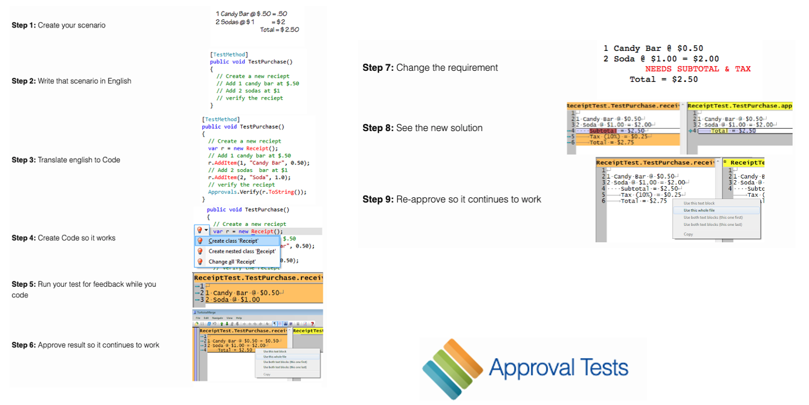
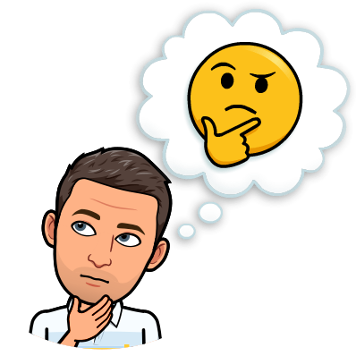

# Gilded Rose Kata
> Challenge for today : prepare a refactoring on the GildedRose class

This Kata was originally created by Terry Hughes (http://twitter.com/TerryHughes). 

It is already on GitHub [here](https://github.com/NotMyself/GildedRose). See also [Bobby Johnson's description of the kata](http://iamnotmyself.com/2011/02/13/refactor-this-the-gilded-rose-kata/).

## Learning Objectives
- Learn a practice that will help you be quickly productive in an unfamiliar environment
- Use `Approval Testing` to deal with legacy code


## Connection - Web hunt
In pair, take a look on the internet and find an answer to this question:
`What is approval testing?`
 


## Concepts
### What is Approval Testing ?
Approval Tests also called `Snapshot Tests` or `Golden Master`
- Work by creating an output that needs `human approval / verification`

Once the initial output has been defined and `APPROVED` then as long as the test provides consistent output then the test will continue to pass.

> Compare your implementation/actual program against approved outputs

Once the test provides output that is different to the approved output the test will fail. 

### The difference with Assert-based tests
- Unit testing asserts can be difficult to use
- Approval tests simplify this by taking a snapshot of the results
  - Confirming that they have not changed

```scala
person.age should be(26)
person.firstName should be("Freddy")
person.name should be("Krueger")
person.address should be(Address("Elm Street", "Springwood"))
...
As many asserts than you check data
```

With `Approval Testing`
```scala
Approvals.verify(person)
```

### Main characteristics
- Human `inspects and approves` some actual program output when creating a test case.
- Design a `Printer` (if necessary) to display complex objects, instead of many assertions.
- If actual program output is not yet available, the approved value may be a manual sketch of the expected output (useful when you do TDD).
- Approved values are `stored separately from the source code` for the test case



## Concrete Practice
Take some time to:
- Read the specifications below
- Take a look at the corresponding code

### Specifications
Hi and welcome to team Gilded Rose. 
As you know, we are a small inn with a prime location in a prominent city ran by a friendly innkeeper named Allison. 
We also buy and sell only the finest goods. 

Unfortunately, our goods are constantly degrading in quality as they approach their sell by date.
We have a system in place that updates our inventory for us. It was developed by a no-nonsense type named Leeroy, who has moved on to new adventures. 

> Your task is to add the new feature to our system so that we can begin selling a new category of items. 

First an introduction to our system:
```text
- All items have a SellIn value which denotes the number of days we have to sell the item
- All items have a Quality value which denotes how valuable the item is
- At the end of each day our system lowers both values for every item
```

Pretty simple, right? Well this is where it gets interesting:
```text
- Once the sell by date has passed, Quality degrades twice as fast
- The Quality of an item is never negative
- "Aged Brie" actually increases in Quality the older it gets
- The Quality of an item is never more than 50
- "Sulfuras", being a legendary item, never has to be sold or decreases in Quality
- "Backstage passes", like aged brie, increases in Quality as its SellIn value approaches;
- Quality increases by 2 when there are 10 days or less and by 3 when there are 5 days or less but
- Quality drops to 0 after the concert
```

We have recently signed a supplier of conjured items. This requires an update to our system:
- "Conjured" items degrade in Quality twice as fast as normal items

> Feel free to make any changes to the UpdateQuality method and add any new code as long as everything still works correctly. 

However, do not alter the Item class or Items property as those belong to the goblin in the corner who will insta-rage and one-shot you as he doesn't believe in shared code ownership (you can make the UpdateQuality method and Items property static if you like, we'll cover for you).

Just for clarification, an item can never have its Quality increase above 50, however "Sulfuras" is a legendary item and as such its Quality is 80 and it never alters.

### Your thoughts
- What do you think about this code ?
- If you must add a new type of items what would be your strategy ?



### A word on complexity


```scala
class GildedRose(val items: Array[Item]) {
  def updateQuality(): Unit = {
    for (i <- 0 until items.length) {
      if (
        !items(i).name.equals("Aged Brie")
        && !items(i).name.equals("Backstage passes to a TAFKAL80ETC concert")
      ) {
        if (items(i).quality > 0) {
          if (!items(i).name.equals("Sulfuras, Hand of Ragnaros")) {
            items(i).quality = items(i).quality - 1
          }
        }
      } else {
        if (items(i).quality < 50) {
          items(i).quality = items(i).quality + 1

          if (
            items(i).name.equals("Backstage passes to a TAFKAL80ETC concert")
          ) {
            if (items(i).sellIn < 11) {
              if (items(i).quality < 50) {
                items(i).quality = items(i).quality + 1
              }
            }

            if (items(i).sellIn < 6) {
              if (items(i).quality < 50) {
                items(i).quality = items(i).quality + 1
              }
            }
          }
        }
      }

      if (!items(i).name.equals("Sulfuras, Hand of Ragnaros")) {
        items(i).sellIn = items(i).sellIn - 1
      }

      if (items(i).sellIn < 0) {
        if (!items(i).name.equals("Aged Brie")) {
          if (
            !items(i).name.equals("Backstage passes to a TAFKAL80ETC concert")
          ) {
            if (items(i).quality > 0) {
              if (!items(i).name.equals("Sulfuras, Hand of Ragnaros")) {
                items(i).quality = items(i).quality - 1
              }
            }
          } else {
            items(i).quality = items(i).quality - items(i).quality
          }
        } else {
          if (items(i).quality < 50) {
            items(i).quality = items(i).quality + 1
          }
        }
      }
    }
  }
}
```

## What did we use / learn ?


## Sources 
- [Approval Tests](https://approvaltests.com/)  

<a href="https://www.youtube.com/watch?v=zyM2Ep28ED8" rel="Emily Bache's video"></a>