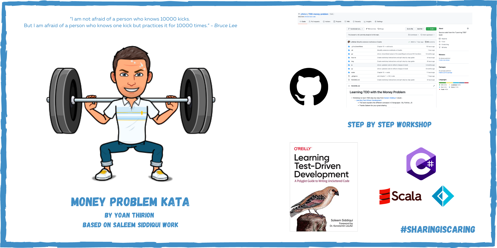

# Learning TDD with the Money Problem
* Workshop to learn TDD step-by-step from [Saleem Siddiqui](https://www.linkedin.com/in/ssiddiqui/) 's book :
    * [Learning Test-Driven Development](https://www.oreilly.com/library/view/learning-test-driven-development/9781098106461/)
        * The book explains the different concepts in 3 languages : Go, Python, JS
        * Thanks Saleem for your great sharing
* You will find other languages in this repository : `C#`, `scala`, `Kotlin`
    * I have chosen to make a step-by-step guide from the book in `C#`

## What is TDD
TDD is a technique borne of a set of beliefs about code :

* Simplicity - the art of maximizing the amount of work *not* done
* Obviousness and clarity are more virtuous than cleverness
* Writing uncluttered code is a key component of being successful

`Test-Driven Development is a way of managing fear during programming - Kant Beck`

### Designing and structuring code
* TDD is not fundamentally about testing code
* Its purpose : `improve the design and structure of the code`
    * The Unit Tests that we end up with are an added bonus
    * Primary benefit : simplicity of design we get

### A bias toward simplicity
* In software we can measure simplicity :
    * Fewer lines of code per feature
    * Lower Cyclomatic Complexity
    * Fewer side effects
    * Smaller runtime / memory requirements
* TDD forces us to craft the simplest thing that works
* Virtue isn't mystical :
    * Using TDD won't cut by half :
        * your development time
        * the lines of code
        * defect count
    * It will allow you to arrest the temptation to introduce artificial / contrived complexity

### Increased Confidence
TDD increases our confidence in our code :

* Each new test flexes the system in new and previously untested ways
* Over time : the tests suite guards us against regression failures

### About this repo
This is a [monorepo](https://trunkbaseddevelopment.com/monorepos/) containing all the source code for the ["Learning Test-Driven Development"](https://learning.oreilly.com/library/view/learning-test-driven-development/9781098106461/) book, published by O'Reilly.

#### Prerequisites
* You need to install the runtime environment for the language you prefer use (Go, Python, C#, Scala, JS)
* To understand the evolution and purpose of the code, you need the accompanying book.

## Workshop
* Follow the instructions for the different steps of this workshop :
    * [Part 1 - Getting Started](how-to/Part1.md)
    * [Part 2 - Modularization](how-to/Part2.md)
    * [Part 3 - Features and Redesign](how-to/Part3.md)
    * [Part 4 - Finishing Up](how-to/Part4.md)
    * [Go Further](how-to/Go-Further.md)

* Each part contains chapters in a step-by-step approach
  * At the end of each chapter you will find a `step by step guide` link
  * It will demonstrate my approach to solve the given problem in `C#`

