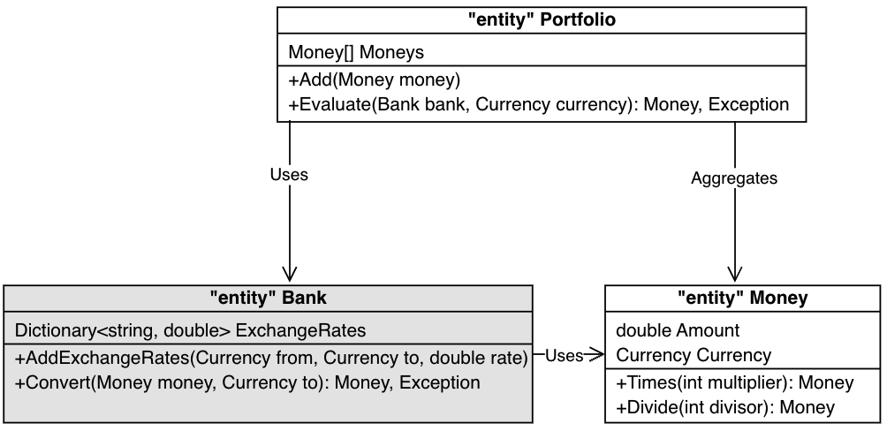

## Part 3 - Features and Redesign
### Chapter 8 - Evaluating a Portfolio
`Money itself isn't lost or made. It's simply transfered from one perception to another. Like magic. - Gordon Gekko, Wall Street`

#### Mixing Money
Heterogeneous combination of currencies demands that we create a new abstraction : conversion of money from one currency to another :
```text
- Conversion always relates a pair of currencies
- Conversion is from one currency to another with a well-defined exchange rate
- The two exchange rates between a pair of currencies may or may not be arithmetical reciprocals of each other
    - Exchange Rate from EUR to USD may or may not be the mathematical reciprocal of USD to EUR
- It is possible for a currency to have no defined exchange rate to another currency
    - Inconvertible currencies : economical, political, ... reasons    
```

* Add our next test `5 USD + 10 EUR = 17 USD`
  * What do we need for that ?
* Make the minimum to pass the tests
* Remove redundancy
  * How could we improve readability of our tests ?

#### Where we are
```text
✅ 5 USD x 2 = 10 USD 
✅ 10 EUR x 2 = 20 EUR
✅ 4002 KRW / 4 = 1000.5 KRW
✅ 5 USD + 10 USD = 15 USD
✅ Separate test code from production code
✅ Remove redundant tests
✅ 5 USD + 10 EUR = 17 USD
1 USD + 1100 KRW = 2200 KRW
Determine exchange rate based on the currencies involved (from -> to)
Allow exchange rates to be modified
```

[step by step guide](step-by-step/chapter8.md)

### Chapter 9 - Currencies, Currencies, Everywhere
```text
1 USD + 1100 KRW = 2200 KRW
Determine exchange rate based on the currencies involved (from -> to)
```

* We can use this table to determine exchange rates :

| From | To   | Rate    |
|------|------|---------|
| EUR  | USD  | 1.2     |
| USD  | EUR  | 0.82    |
| USD  | KRW  | 1100    |
| KRW  | EUR  | 0.0009  |
| EUR  | KRW  | 1344    |
| KRW  | EUR  | 0.00073 |

* Let's write our next test `1 USD + 1100 KRW = 2200 KRW`
* How could make it pass ?
* What happens if we try to evaluate in a currency without `exchangeRates` ?
  * How to improve it ?

#### Where we are
```text
✅ 5 USD x 2 = 10 USD 
✅ 10 EUR x 2 = 20 EUR
✅ 4002 KRW / 4 = 1000.5 KRW
✅ 5 USD + 10 USD = 15 USD
✅ Separate test code from production code
✅ Remove redundant tests
✅ 5 USD + 10 EUR = 17 USD
✅ 1 USD + 1100 KRW = 2200 KRW
✅ Determine exchange rate based on the currencies involved (from -> to)
Improve error handling when exchange rates are unspecified
Allow exchange rates to be modified
```

[step by step guide](step-by-step/chapter9.md)

### Chapter 10 - Error Handling
`What error drives our eyes and ears amiss ? - William Shakespeare`

#### Error Wish List
```text
- The Evaluate method should signal an explicit error when one or more necessary exchange rates ares missing
- The error message should be "greedy" - indicate all the missing exchange rates
- To prevent error from being ignored by the caller : no valid Money should be returned when an error happens due to missing exchange rates
```

* We will use exception here in case of failure
  * How could we implement it differently ?
* Refactor : what can be improved ?

#### Where we are
* We have added error handling
    * Portfolio evaluation is not simple anymore
        * Clumsy code to check if we have missing exchange rates
    * Let's add a new feature in our list
```text
✅ 5 USD x 2 = 10 USD 
✅ 10 EUR x 2 = 20 EUR
✅ 4002 KRW / 4 = 1000.5 KRW
✅ 5 USD + 10 USD = 15 USD
✅ Separate test code from production code
✅ Remove redundant tests
✅ 5 USD + 10 EUR = 17 USD
✅ 1 USD + 1100 KRW = 2200 KRW
✅ Determine exchange rate based on the currencies involved (from -> to)
✅ Improve error handling when exchange rates are unspecified
Improve the implementation of exchange rates
Allow exchange rates to be modified
```

[step by step guide](step-by-step/chapter10.md)

### Chapter 11 - Banking on Redesign
`On the whole it's worth evolving your design as your needs grow... - Martin Fowler`

* Our `Portfolio` does too much work
    * Its primary job is to be a repository of `Money` entities
    * Not to manage Exchange Rates
* Our software program has grown with our needs
    * It is worth improving our design and looking for a better abstraction
* A principle of Domain Driven Design is continuous learning
    * We are missing a key entity
    * `What is the name of the real-world institution that helps us exchange money ?`

#### Bank concept
* What should be its responsibility ?
    * Hold exchange rates
    * Convert money between currencies

#### Dependency Injection
* We have identified a new entity
    * How should the dependencies between `Bank` and the other two existing entities look ?
      
    * The dependency of `Portfolio` on `Bank` is kept to a minimum
        * `Bank` is provided as a parameter to the `Evaluate` method
        * We do `method injection`

#### Putting It All Together
* Let's write a test to convert one `Money` object into another in the `Bank` entity
* We write the minimum to pass the test
* All our tests are green
    * We are ready to change our `Portfolio.Evaluate` method
      * What is the impact on our existing tests ?
* We now run the tests
    * Does it find any regression ?
    * If yes, add a test on it to ensure the regression will never come back
* Every tests are now green
    * Let's commit our work
* Refactor
  * Do you have any duplication ?
  * What can be improved ?

#### Use a more functional approach
* The rule : do not have `try/catch` for under control behaviors
* Add nuget package `LanguageExt.Core` for this purpose
  * Use the `Either` monadic structure to represent the failure
  * Adapt your tests then your production code
* Remove duplication and dead code (no more Exception required)

#### Where we are
* We changed internal organization of our code
* We used a combination of new tests and our existing suite of tests to ensure no features we harmed during this writing
* We cleaned up our tests as well
* We have only one feature remaining to implement :
```text
✅ 5 USD x 2 = 10 USD 
✅ 10 EUR x 2 = 20 EUR
✅ 4002 KRW / 4 = 1000.5 KRW
✅ 5 USD + 10 USD = 15 USD
✅ Separate test code from production code
✅ Remove redundant tests
✅ 5 USD + 10 EUR = 17 USD
✅ 1 USD + 1100 KRW = 2200 KRW
✅ Determine exchange rate based on the currencies involved (from -> to)
✅ Improve error handling when exchange rates are unspecified
✅ Improve the implementation of exchange rates
Allow exchange rates to be modified
```

[step by step guide](step-by-step/chapter11.md)