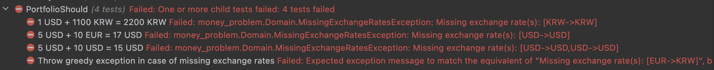

### Chapter 11 - Banking on Redesign
`On the whole it's worth evolving your design as your needs grow... - Martin Fowler`

* Our `Portfolio` does too much work
    * Its primary job is to be a repository of `Money` entities
    * Not to manage Exchange Rates
* Our software program has grown with our needs
    * It is worth improving our design and looking for a better abstraction
* A principle of Domain Driven Design is continuous learning
    * We are missing a key entity
    * `What is the name of the real-world institution that helps us exchange money ?`

#### Bank concept
* What should be its responsibility ?
    * Hold exchange rates
    * Convert money between currencies

#### Dependency Injection
* We have identified a new entity
    * How should the dependencies between `Bank` and the other two existing entities look ?
      
    * The dependency of `Portfolio` on `Bank` is kept to a minimum
        * `Bank` is provided as a parameter to the `Evaluate` method
        * We do `method injection`

#### Putting It All Together
* Let's write a test to convert one `Money` object into another :
    * We choose to make an immutable data structure as well
```c#
[Fact(DisplayName = "10 EUR -> USD = 12 USD")]
public void ConvertEuroToUsd()
{
    // WithExchangeRates will be our Factory method
    var bank = Bank.WithExchangeRates(EUR, USD, 1.2);

    bank.Convert(10d.Euros(), USD)
        .Should()
        .Be(12d.Dollars());
}
```
* We write the minimum to pass the test
    * Initialize an empty Dictionary
    * Forming a key to store the exchange rate
    * Create the convert method that returns `Money`
```c#
public record Bank
{
    private readonly ImmutableDictionary<string, double> _exchangeRates;

    private Bank(ImmutableDictionary<string, double> exchangeRates) => _exchangeRates = exchangeRates;

    public static Bank WithExchangeRates(Currency from, Currency to, double rate) =>
        new Bank(new Dictionary<string, double>().ToImmutableDictionary())
            .AddExchangeRates(from, to, rate);

    private Bank AddExchangeRates(Currency from, Currency to, double rate) =>
        new(_exchangeRates.Add(KeyFor(from, to), rate));

    private static string KeyFor(Currency from, Currency to) => $"{from}->{to}";

    public Money Convert(Money money, Currency currency) =>
        currency == money.Currency
            ? money
            : new Money(money.Amount * _exchangeRates[KeyFor(money.Currency, currency)], currency);
} 
```
* We now need to keep existing behavior
    * Throws a greedy exception on missing exchange rates
* Let's write a new test
```c#
[Fact(DisplayName = "Throw missing exchange rate exception in case of missing exchange rates")]
public void ConvertWithMissingExchangeRateShouldThrowException()
{
    var portfolio = Bank.WithExchangeRates(EUR, USD, 1.2);

    portfolio.Invoking(p => p.Convert(10d.Euros(), KRW))
        .Should()
        .Throw<MissingExchangeRateException>()
        .WithMessage("Missing exchange rate(s): [EUR->KRW]");
}
```
* Implement the minimum to pass the test
```c#
public record Bank
{
    private readonly ImmutableDictionary<string, double> _exchangeRates;

    private Bank(ImmutableDictionary<string, double> exchangeRates) => _exchangeRates = exchangeRates;

    public static Bank WithExchangeRates(Currency from, Currency to, double rate) =>
        new Bank(new Dictionary<string, double>().ToImmutableDictionary())
            .AddExchangeRates(from, to, rate);

    private Bank AddExchangeRates(Currency from, Currency to, double rate) =>
        new(_exchangeRates.Add(KeyFor(from, to), rate));

    private static string KeyFor(Currency from, Currency to) => $"{from}->{to}";

    public Money Convert(Money money, Currency currency)
    {
        CheckExchangeRates(money.Currency, currency);
        return currency == money.Currency
            ? money
            : new Money(money.Amount * _exchangeRates[KeyFor(money.Currency, currency)], currency);
    }

    private void CheckExchangeRates(Currency from, Currency to)
    {
        var key = KeyFor(from, to);
        if (!_exchangeRates.ContainsKey(key))
            throw new MissingExchangeRateException(key);
    }
}
```
* All our tests are green
    * We are ready to change our `Portfolio.Evaluate` method
        * Inject the `Bank` and delegate `conversion` to it
    * We make the minimum to implement it
```c#
public record Portfolio(params Money[] Moneys)
{
    public Money Evaluate(
        Bank bank,
        Currency toCurrency)
    {
        var failures = new List<MissingExchangeRateException>();
        var evaluatedPortfolio = new Money(
            Moneys.Aggregate(0d, (acc, money) =>
            {
                var convertedMoney = 0d;

                try
                {
                    convertedMoney = bank.Convert(money, toCurrency).Amount;
                }
                catch (MissingExchangeRateException e)
                {
                    failures.Add(e);
                }

                return acc + convertedMoney;
            }),
            toCurrency);

        return failures.Count == 0
            ? evaluatedPortfolio
            : throw new MissingExchangeRatesException(failures.Select(e => e.Message));
    }
}
```
* Our `Portfolio` tests do not compile anymore
    * We need to inject our `Bank` entity
```c#
// We setup it for all our tests
private readonly Bank _bank =
    Bank.WithExchangeRate(EUR, USD, 1.2)
        .AddExchangeRate(USD, KRW, 1100);

[Fact(DisplayName = "5 USD + 10 USD = 15 USD")]
public void Add()
{
    var portfolio = 5d.Dollars().AddToPortfolio(10d.Dollars());
    // Inject the bank through method injection
    portfolio.Evaluate(_bank, USD)
        .Should()
        .Be(15d.Dollars());
}
```
* We now run the tests
    * Sh** I have introduced a regression
      
    * We can not convert from one currency to the same currency anymore
* Let's add a test on it to ensure the regression will never come back
```c#
[Fact(DisplayName = "10 EUR -> EUR = 10 EUR")]
public void ConvertMoneyInTheSameCurrency()
{
    var bank = Bank.WithExchangeRate(EUR, USD, 1.2);

    bank.Convert(10d.Euros(), EUR)
        .Should()
        .Be(10d.Euros());
}
```
* Now we can fix this regression
```c#
private void CheckExchangeRates(Currency from, Currency to)
{
    if (from == to) return;
    var key = KeyFor(from, to);
    if (!_exchangeRates.ContainsKey(key))
        throw new MissingExchangeRateException(key);
}
```
* Every tests are now green
    * Let's commit our work

#### Refactor
* We have introduced some duplication : `MissingExchangeRateException`, `MissingExchangeRatesException`
* We have a huge try/catch
    * It could be better to not throw Exception from the `Bank` entity : prefer returning a data structure representing the result of the conversion
    * Result is either Money or a failure message
    * Let's use this data structure

* Add nuget package `LanguageExt.Core` for this purpose
    * Change our tests first :
```c#
public class BankShould
{
    [Fact(DisplayName = "10 EUR -> USD = 12 USD")]
    public void ConvertEuroToUsd()
    {
        var bank = Bank.WithExchangeRate(EUR, USD, 1.2);

        bank.Convert(10d.Euros(), USD)
            .RightUnsafe()
            .Should()
            .Be(12d.Dollars());
    }

    [Fact(DisplayName = "10 EUR -> EUR = 10 EUR")]
    public void ConvertMoneyInTheSameCurrency()
    {
        var bank = Bank.WithExchangeRate(EUR, USD, 1.2);

        bank.Convert(10d.Euros(), EUR)
            .RightUnsafe()
            .Should()
            .Be(10d.Euros());
    }

    [Fact(DisplayName = "Return a Left in case of missing exchange rates")]
    public void ConvertWithMissingExchangeRateShouldThrowException()
    {
        var bank = Bank.WithExchangeRate(EUR, USD, 1.2);

        bank.Convert(10d.Euros(), KRW)
            .LeftUnsafe()
            .Should()
            .Be("EUR->KRW");
    }
} 
```
* Create some extensions for Test purpose only
```c#
public static class LanguageExtExtensions
{
    public static TLeft LeftUnsafe<TLeft, TRight>(this Either<TLeft, TRight> either)
        => either.LeftToSeq().Single();

    public static TRight RightUnsafe<TLeft, TRight>(this Either<TLeft, TRight> either)
        => either.RightToSeq().Single();
}
```
* Refactor our production code starting from our Bank
    * Change the signature of the `Convert` method
    * Simplify conversion code
```c#
public Either<string, Money> Convert(Money money, Currency currency) =>
    CanConvert(money.Currency, currency)
        ? ConvertSafely(money, currency)
        : Left(KeyFor(money.Currency, currency));

private EitherRight<Money> ConvertSafely(Money money, Currency currency) =>
    Right(currency == money.Currency
        ? money
        : new Money(money.Amount * _exchangeRates[KeyFor(money.Currency, currency)], currency));

private bool CanConvert(Currency from, Currency to) =>
    from == to || _exchangeRates.ContainsKey(KeyFor(from, to)); 
```
* Change our `Portfolio` implementation to reflect our changes
    * No more huge try/catch that can ruin our performance
```c#
public Money Evaluate(
    Bank bank,
    Currency toCurrency)
{
    var convertedMoneys =
        Moneys
            .Map(m => bank.Convert(m, toCurrency))
            .ToList();

    return !convertedMoneys.Lefts().Any()
        ? new Money(convertedMoneys.Rights().Fold(0d, (acc, money) => acc + money.Amount), toCurrency)
        : throw new MissingExchangeRatesException(convertedMoneys.Lefts());
} 
```

#### Remove exception from Portfolio
* Let's change the `Evaluate` method as done previously
    * Start with our tests
```c#
public class PortfolioShould
{
    private readonly Bank _bank =
        Bank.WithExchangeRate(EUR, USD, 1.2)
            .AddExchangeRate(USD, KRW, 1100);

    [Fact(DisplayName = "5 USD + 10 USD = 15 USD")]
    public void Add()
    {
        var portfolio = 5d.Dollars().AddToPortfolio(10d.Dollars());
        portfolio.Evaluate(_bank, USD)
            .RightUnsafe()
            .Should()
            .Be(15d.Dollars());
    }

    [Fact(DisplayName = "5 USD + 10 EUR = 17 USD")]
    public void AddDollarsAndEuros()
    {
        var portfolio = 5d.Dollars().AddToPortfolio(10d.Euros());
        portfolio.Evaluate(_bank, USD)
            .RightUnsafe()
            .Should()
            .Be(17d.Dollars());
    }

    [Fact(DisplayName = "1 USD + 1100 KRW = 2200 KRW")]
    public void AddDollarsAndKoreanWons()
    {
        var portfolio = 1d.Dollars().AddToPortfolio(1100d.KoreanWons());
        portfolio.Evaluate(_bank, KRW)
            .RightUnsafe()
            .Should()
            .Be(2200d.KoreanWons());
    }

    [Fact(DisplayName = "Return a Left in case of missing exchange rates")]
    public void AddWithMissingExchangeRatesShouldReturnALeft()
    {
        var portfolio = 1d.Dollars()
            .AddToPortfolio(1d.Euros())
            .AddToPortfolio(1d.KoreanWons());

        portfolio.Evaluate(_bank, KRW)
            .LeftUnsafe()
            .Should()
            .Be("Missing exchange rate(s): [EUR->KRW]");
    }
} 
```
* Then refactor `Portfolio`
```c#
public Either<string, Money> Evaluate(
    Bank bank,
    Currency toCurrency)
{
    var convertedMoneys = Moneys
        .Map(m => bank.Convert(m, toCurrency))
        .ToList();

    return !convertedMoneys.Lefts().Any()
        ? new Money(convertedMoneys.Rights().Fold(0d, (acc, money) => acc + money.Amount), toCurrency)
        : Left($"Missing exchange rate(s): [{string.Join(",", convertedMoneys.Lefts())}]");
}
```
* We can remove `dead code` as well:
    * `MissingExchangeRateException`, `MissingExchangeRatesException`

#### Where we are
* We changed internal organization of our code
* We used a combination of new tests and our existing suite of tests to ensure no features we harmed during this writing
* We cleaned up our tests as well
* We have only one feature remaining to implement :
```text
✅ 5 USD x 2 = 10 USD 
✅ 10 EUR x 2 = 20 EUR
✅ 4002 KRW / 4 = 1000.5 KRW
✅ 5 USD + 10 USD = 15 USD
✅ Separate test code from production code
✅ Remove redundant tests
✅ 5 USD + 10 EUR = 17 USD
✅ 1 USD + 1100 KRW = 2200 KRW
✅ Determine exchange rate based on the currencies involved (from -> to)
✅ Improve error handling when exchange rates are unspecified
✅ Improve the implementation of exchange rates
Allow exchange rates to be modified
```