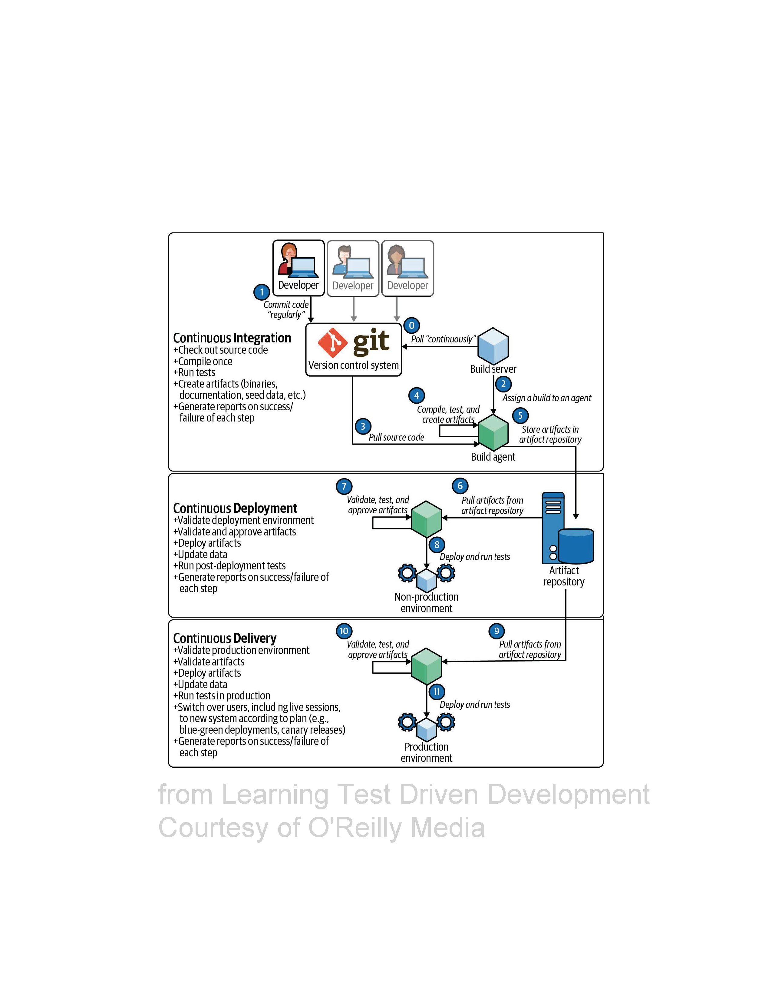

### Chapter 13 - Continuous Integration
> With continuous integration, your software is proven to work (assuming a sufficiently comprehensive set of automated tests) with every new change-and you now the moment it breaks and can fix it immediately - *Jez Humble and David Farley*

* Software entropy is the principle that the degree of disorder in a system tends to increase over time
* Our best current defense against the ruinous effect of code chaos is `Continuous Delivery`



#### Putting It All Together
* We'll use GitHub Actions to add continuous integration to our project
* Here are the steps to build a CI Pipeline for our code :

```
1. Create and/or verify our GitHub account
2. Create a new project in GitHub
3. Push our code repository to GitHub
4. Prepare the source code for CI build scripts
5. Create a CI build script for our language (C# here)
6. Push the build scripts to GitHub
```

```yaml
name: C# CI

on: [push]

jobs:
  build:
    runs-on: ubuntu-latest
    strategy:
      matrix:
        dotnet-version: ['6.0.x' ]
        platform: [ubuntu-latest, macos-latest, windows-latest]
    steps:
      - uses: actions/checkout@v2
      - name: Setup .NET Core SDK ${{ matrix.dotnet-version }}
        uses: actions/setup-dotnet@v1.7.2
        with:
          dotnet-version: ${{ matrix.dotnet-version }}
      - name: Install dependencies
        run: dotnet restore c#
      - name: Build
        run: dotnet build --configuration Release --no-restore c#
      - name: Test
        run: dotnet test --no-restore --verbosity normal c#
```

#### Where we are
* At end of our journey of writing code to solve the “Money” problem
* We have covered a lot of ground
    * We have written code
    * Written tests
    * Deleted and refined both
    * Added continuous integration
* There’s something more that we deserve and need: a review of our journey