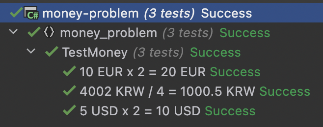

### Chapter 2 - Multi-currency Money
* Second item in our feature list : `10 EUR x 2 = 20 EUR`
* We need a more general concept than `Dollar`
    * Money for example

#### Let's write our new test
```c#
[Fact]
public void TestMultiplicationInEuro()
{
    var tenEuros = new Money(10, "EUR");
    var twentyEuros = tenEuros.Times(2);

    twentyEuros.Amount.Should().Be(20);
    twentyEuros.Currency.Should().Be("EUR");
}
```

#### Make it green
```c#
public record Money(int Amount, string Currency)
{
    public Money Times(int multiplier) => this with { Amount = Amount * multiplier };
}
```

#### DRY - Remove duplication
* We now have 2 classes that could be simplified

```c#
public record Money(int Amount, string Currency)
{
    public Money Times(int multiplier) => this with { Amount = Amount * multiplier };
}

public record Dollar(int Amount)
{
    public Dollar Times(int multiplier) => new(Amount * multiplier);
}
```

* What else ?
    * We repeat "EUR" in our tests
    * Create a struct representing the supported currencies

```c#
namespace money_problem
{
    public class TestMoney
    {
        [Fact]
        public void MultiplicationInUsd()
        {
            var fiver = new Money(5, Currency.USD);
            var tenner = fiver.Times(2);

            tenner.Amount.Should().Be(10);
            tenner.Currency.Should().Be(Currency.USD);
        }
    
        [Fact]
        public void MultiplicationInEuro()
        {
            var tenEuros = new Money(10, Currency.EUR);
            var twentyEuros = tenEuros.Times(2);

            twentyEuros.Amount.Should().Be(20);
            twentyEuros.Currency.Should().Be(Currency.EUR);
        }
    }

    public record Money(int Amount, Currency Currency)
    {
        public Money Times(int multiplier) => this with { Amount = Amount * multiplier };
    }

    public enum Currency { EUR , USD }
}
```

#### Divide and Conquer
* Allow division on `Money` : `4002 KRW / 4 = 1000.5 KRW`
* Write the test

```c#
[Fact(DisplayName = "4002 KRW / 4 = 1000.5 KRW")]
public void Division()
{
    var originalMoney = new Money(4002, Currency.KRW);
    var actualMoneyAfterDivision = originalMoney.Divide(4);

    actualMoneyAfterDivision.Should().Be(new Money(1000.5, Currency.KRW));
}
```

#### Make it green
* We need to change the type of Amount -> in double now
* We must add a new Currency

```c#
public record Money(double Amount, Currency Currency)
{
    public Money Times(int multiplier) => this with { Amount = Amount * multiplier };
    public Money Divide(int divisor) => this with {Amount = Amount / divisor};
}

public enum Currency { EUR , USD, KRW }
```

* Using `DisplayName` in the `Fact Attribute` allows us to have this in our test results
* 

#### Cleaning Up
* Remove duplication
    * We assert always the same stuff

```c#
[Fact(DisplayName = "5 USD x 2 = 10 USD")]
public void MultiplicationInUsd()
{
    var fiver = new Money(5, Currency.USD);
    var tenner = fiver.Times(2);

    tenner.Amount.Should().Be(10);
    tenner.Currency.Should().Be(Currency.USD);
}

[Fact(DisplayName = "10 EUR x 2 = 20 EUR")]
public void MultiplicationInEuro()
{
    var tenEuros = new Money(10, Currency.EUR);
    var twentyEuros = tenEuros.Times(2);

    twentyEuros.Amount.Should().Be(20);
    twentyEuros.Currency.Should().Be(Currency.EUR);
}

[Fact(DisplayName = "4002 KRW / 4 = 1000.5 KRW")]
public void Division()
{
    var originalMoney = new Money(4002, Currency.KRW);
    var actualMoneyAfterDivision = originalMoney.Divide(4);

    actualMoneyAfterDivision.Amount.Should().Be(1000.5);
    actualMoneyAfterDivision.Currency.Should().Be(Currency.KRW);
}
```

* We can use record value equality to simplify assertions

```c#
[Fact(DisplayName = "5 USD x 2 = 10 USD")]
public void MultiplicationInUsd()
{
    var fiveDollars = new Money(5, Currency.USD);
    fiveDollars.Times(2)
        .Should()
        .Be(new Money(10, Currency.USD));
}

[Fact(DisplayName = "10 EUR x 2 = 20 EUR")]
public void MultiplicationInEuro()
{
    var tenEuros = new Money(10, Currency.EUR);
    tenEuros.Times(2)
        .Should()
        .Be(new Money(20, Currency.EUR));
}

[Fact(DisplayName = "4002 KRW / 4 = 1000.5 KRW")]
public void Division()
{
    var originalMoney = new Money(4002, Currency.KRW);
    originalMoney.Divide(4)
        .Should()
        .Be(new Money(1000.5, Currency.KRW));
}
```

#### Where we are ?
* We built a second feature : `division`
* We changed our design to deal with numbers with fractions
* We have a couple of passing tests
* We have introduced a `Money` entity to deal with various currencies
* We cleaned our code along the way

```text
✅ 5 USD x 2 = 10 USD 
✅ 10 EUR x 2 = 20 EUR
✅ 4002 KRW / 4 = 1000.5 KRW
5 USD + 10 EUR = 17 USD
1 USD + 1100 KRW = 2200 KRW
```