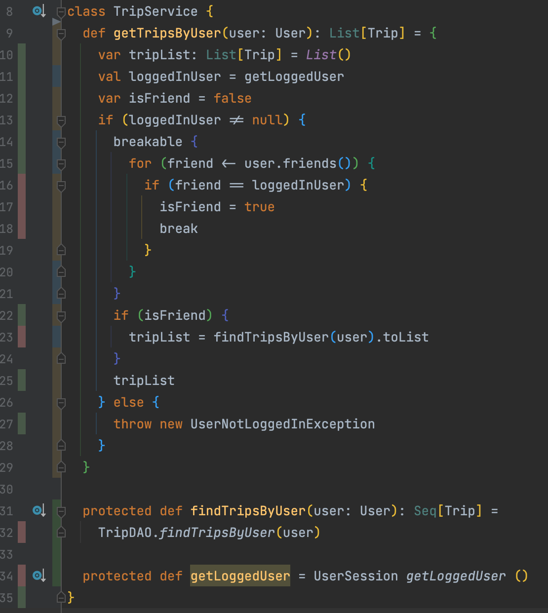
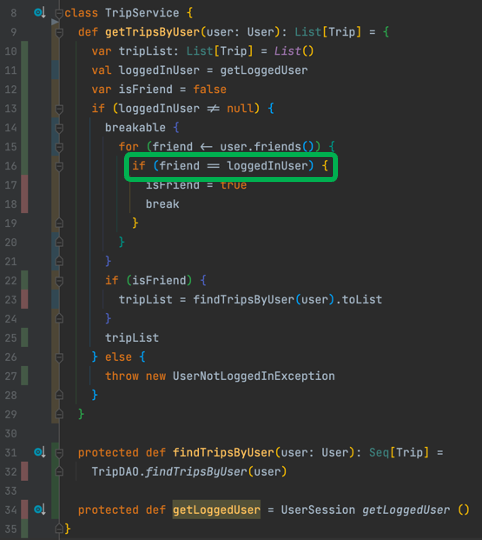

## Cover our code
- Identify code smells in the `TripService` class

```scala
class TripService {
	// Too many responsibilities
	// Hidden dependencies : Session / DAO
	def getTripsByUser(user: User): List[Trip] = {
		// Mutation everywhere
		var tripList: List[Trip] = List()
		// Object method like static method in other languages 
		val loggedInUser = UserSession getLoggedUser()
		var isFriend = false
		
		// CC too high
		if (loggedInUser != null) {
			// What is the logic here ?
			breakable { for (friend <- user.friends()) {
				if (friend == loggedInUser) {
					isFriend = true
					break
				}
			}}
			// 
			if (isFriend) {
				// Object method like static method in other languages
				tripList = TripDAO.findTripsByUser(user)
			}
			tripList
		} else {
			// Return a Try or an Either instead of throwing this exception
			throw new UserNotLoggedInException
		}
	}
}
// Why do we have a backup class in the repository ?
```

### Write a first test (naively)
```scala
"Retrieving the trips by user" should "throw an exception when user not logged in" in {
    val tripService = new TripService()
    
    assertThrows[UserNotLoggedInException] {
        tripService.getTripsByUser(null)
    }
}
```
- Here we have a problem
	- The exception thrown is not the expected one : `Expected exception org.craftedsw.tripservicekata.exception.UserNotLoggedInException to be thrown, but org.craftedsw.tripservicekata.exception.CollaboratorCallException was thrown`
	- This exception is thrown by a hidden collaborator : `UserSession`
- We will have the same problem with the other hidden dependencies

> How could we make it testable ?

### Seams
- Adding tests on the existing code can be challenging
- The code was not written to be testable in the first place
- 99% of the time, this is a dependency problem
- 	The code you want to test can’t run
	- It needs something hard to put in the test :
		- A database connection 
		- A third-party server
		- A parameter that’s complex to instantiate
	- Usually, it’s a complex mix of all that.

> To test your code, you need to break these dependencies in the tests.

Therefore, you need to identify `Seams`.

`A Seam is a place to alter program behavior, without changing the code.`

There are different types of Seams. 
The gist of it is to identify how you can change the code behavior without touching the source code.

If your language is Object-Oriented, the most common and convenient Seam is an object.

Consider this piece of JavaScript code :

```js
export class DatabaseConnector {
  // A lot of code…

  connect() {
    // Perform some calls to connect to the DB.
  }
}
```

Say the connect() method is causing you problems when you try to put code into tests. Well, the `whole class is a Seam you can alter`.

You can extend this class in tests to prevent it from connecting to an actual DB:

```js
class FakeDatabaseConnector extends DatabaseConnector {
  connect() {
    // Override the problematic calls to the DB
    console.log("Connect to the DB")
  }
}
```

### Isolate the Singleton dependencies
- Isolate the Singleton dependencies in their own method

```scala
UserSession getLoggedUser()
TripDAO.findTripsByUser(user)
```

- Do it via automated `extract method` automated refactoring

```scala
class TripService {
  def getTripsByUser(user: User): List[Trip] = {
    ...
    val loggedInUser = getLoggedUser
    ...    
    if (isFriend) {
        tripList = findTripsByUser(user).toList
    }
    ...
  }

  protected def findTripsByUser(user: User): Seq[Trip] =
    TripDAO.findTripsByUser(user)

  protected def getLoggedUser = UserSession getLoggedUser ()
}
```

### Refactor our first test
- In our test class, we can now extend the `TripService` class
- We can now override the `private` to `protected` methods we created making them return whatever we need for our unit tests

```scala
private def createTripService() =
    new TripService {
      override protected def getLoggedUser: User = loggedUser
    
      override protected def findTripsByUser(user: User): Seq[Trip] =
        user.trips()
  }
```

- Refactor the test to use the `TripService` for tests class
```scala
class TripServiceSpec extends UnitSpec {
  private var loggedUser: User = new User()
  private val nonLoggedUser = null
  private val tripService: TripService = createTripService()

  "Retrieving the trips by user" should "throw an exception when user not logged in" in {
    loggedUser = nonLoggedUser
    assertThrows[UserNotLoggedInException] {
      tripService.getTripsByUser(null)
    }
  }

  private def createTripService() =
    new TripService {
      override protected def getLoggedUser: User = loggedUser

      override protected def findTripsByUser(user: User): Seq[Trip] =
        user.trips()
    }
}
```

### Coverage as a Driver
- Run your favorite `code coverage` tool
- Use the result as a driver for implementing/writing new tests


- `From shortest to deepest branch`, what is our next test to write ?

```scala
  "Retrieving the trips by user" should "return no trips when logged user is not a friend" in {
    val trips = tripService.getTripsByUser(targetUser)
    assert(trips.isEmpty)
  }
```
- This test is green when running alone
  - But red when ran with the rest of the test class...
  - We have introduced a strong dependency between our tests through the `loggedUser`
  - We must ensure to respect FIRST principle
    - `Fast` : Tests should be fast enough that you won't be discouraged from using them
    - `Isolated` : Tests should not depend on the state of another test
    - `Repeatable` : Tests should be repeatable in any environment without varying results
    - `Self validating` : Each test will have a single boolean output of pass or fail
    - `Thorough` : The tests we write should cover all happy paths/edge/corner/boundary cases
- Let's isolate our tests :
    - With `scalatest` we can use the trait `BeforeAndAfterEach` to set up our tests :
```scala
class TripServiceSpec extends UnitSpec with BeforeAndAfterEach {
  private var loggedUser: User = _
  private val targetUser: User = new User()
  private val nonLoggedUser = null
  private val tripService: TripService = createTripService()

  override def beforeEach(): Unit = {
    loggedUser = new User()
  }

  "Retrieving the trips by user" should "throw an exception when user not logged in" in {
    loggedUser = nonLoggedUser
    assertThrows[UserNotLoggedInException] {
      tripService.getTripsByUser(null)
    }
  }

  "Retrieving the trips by user" should "return no trips when logged user is not a friend" in {
    val trips = tripService.getTripsByUser(targetUser)
    assert(trips.isEmpty)
  }
  ...
}
```

- We have improved our coverage

- BUT do we do enough in our last test ?
  - The user on which we ask for trips does not contain any trips nor any friends...
  - `we can not be sure our feature is implemented well`
  - We need to improve our test setup
    - We clean up a little the code as well
      - Avoid having not named values like `null` or `new Trip()` in your tests
      - Give sense to those by naming them

```scala
class TripServiceSpec extends UnitSpec with BeforeAndAfterEach {
  private val guest = null
  private val unusedUser = null
  private val registeredUser: User = new User()
  private val anotherUser: User = new User()
  private val toPortugal: Trip = new Trip()

  private val tripService: TripService = createTripService()
  private var loggedInUser: User = _

  override def beforeEach(): Unit = {
    loggedInUser = registeredUser
  }

  "Retrieving the trips by user" should "throw an exception when user not logged in" in {
    loggedInUser = guest
    assertThrows[UserNotLoggedInException] {
      tripService.getTripsByUser(unusedUser)
    }
  }

  "Retrieving the trips by user" should "return no trips when users are not friends" in {
    val aUserWithTrips = new User()
    aUserWithTrips.addTrip(toPortugal)
    aUserWithTrips.addFriend(anotherUser)

    val trips = tripService.getTripsByUser(aUserWithTrips)

    assert(trips.isEmpty)
  }

  private def createTripService() =
    new TripService {
      override protected def getLoggedUser: User = loggedInUser

      override protected def findTripsByUser(user: User): Seq[Trip] =
        user.trips()
    }
}
```



- Let's cover the `happy path`
```scala 
class TripServiceSpec extends UnitSpec with BeforeAndAfterEach {
  private val guest = null
  private val unusedUser = null
  private val registeredUser: User = new User()
  private val anotherUser: User = new User()

  private val toPortugal: Trip = new Trip()
  private val toSpringfield: Trip = new Trip()

  private val tripService: TripService = createTripService()
  private var loggedInUser: User = _

  override def beforeEach(): Unit = {
    loggedInUser = registeredUser
  }

  "Retrieving the trips by user" should "throw an exception when user not logged in" in {
    loggedInUser = guest
    assertThrows[UserNotLoggedInException] {
      tripService.getTripsByUser(unusedUser)
    }
  }

  "Retrieving the trips by user" should "return no trips when users are not friends" in {
    val aUserWithTrips = new User()
    aUserWithTrips.addTrip(toPortugal)
    aUserWithTrips.addFriend(anotherUser)

    val trips = tripService.getTripsByUser(aUserWithTrips)

    assert(trips.isEmpty)
  }

  "Retrieving the trips by user" should "return friend trips when users are friends" in {
    val aUserWithTrips = new User()
    aUserWithTrips.addTrip(toPortugal)
    aUserWithTrips.addTrip(toSpringfield)
    aUserWithTrips.addFriend(anotherUser)
    aUserWithTrips.addFriend(loggedInUser)

    val trips = tripService.getTripsByUser(aUserWithTrips)

    assert(trips.size == 2)
  }

  private def createTripService() =
    new TripService {
      override protected def getLoggedUser: User = loggedInUser

      override protected def findTripsByUser(user: User): Seq[Trip] =
        user.trips()
    }
} 
```

### What can be improved ?
- We have some duplications in our tests
  - And some test setups already require somne cognitive resources to understand what is going on :
```scala
val aUserWithTrips = new User()
aUserWithTrips.addTrip(toPortugal)
aUserWithTrips.addTrip(toSpringfield)
aUserWithTrips.addFriend(anotherUser)
aUserWithTrips.addFriend(loggedInUser)
```
- Let's use [Test Data Builders](http://www.natpryce.com/articles/000714.html) to improve it
  - It helps to hide / encapsulate / centralize the creation of your objects
    - Make it more flexible if your design change
  - Make your tests more readable and more business oriented
- Define your builder from your IDE
  - Type it directly in your test

```scala
val aUserWithTrips = UserBuilder.aUser()
  .friendsWith(anotherUser, loggedInUser)
  .travelledTo(toPortugal, toSpringfield)
  .build()
```
- Now let our IDE generates the code for us
```scala
class UserBuilder {
  private var friends: Seq[User] = Seq.empty
  private var trips: Seq[Trip] = Seq.empty

  def friendsWith(friends: User*): UserBuilder = {
    this.friends = friends
    this
  }

  def travelledTo(trips: Trip*): UserBuilder = {
    this.trips = trips
    this
  }

  def build(): User = {
    val user = new User()
    addFriendsTo(user)
    addTripsTo(user)
    user
  }

  private def addTripsTo(user: User): Unit = trips.foreach(user.addTrip)
  private def addFriendsTo(user: User): Unit = friends.foreach(user.addFriend)
}

object UserBuilder {
  def aUser(): UserBuilder = new UserBuilder
}
```
- Improve the builder with a Higher Order Function that avoid duplication


### End state

```scala
package org.craftedsw.tripservicekata.trip

import org.craftedsw.tripservicekata.user.User

class UserBuilder {
  private var friends: Seq[User] = Seq.empty
  private var trips: Seq[Trip] = Seq.empty

  def friendsWith(friends: User*): UserBuilder =
    assign(_ => this.friends = friends)

  def travelledTo(trips: Trip*): UserBuilder =
    assign(_ => this.trips = trips)

  private def assign(func: Any => Unit): UserBuilder = {
    func()
    this
  }

  def build(): User = {
    val user = new User()
    addFriendsTo(user)
    addTripsTo(user)
    user
  }

  private def addTripsTo(user: User): Unit = trips.foreach(user.addTrip)

  private def addFriendsTo(user: User): Unit = friends.foreach(user.addFriend)
}

object UserBuilder {
  def aUser(): UserBuilder = new UserBuilder
}
```

- Use it in all of our tests
```scala
package org.craftedsw.tripservicekata.trip

import org.craftedsw.tripservicekata.exception.UserNotLoggedInException
import org.craftedsw.tripservicekata.infrastructure.UnitSpec
import org.craftedsw.tripservicekata.user.User
import org.scalatest.BeforeAndAfterEach

class TripServiceSpec extends UnitSpec with BeforeAndAfterEach {
  private val guest = null
  private val unusedUser = null
  private val registeredUser: User = UserBuilder.aUser().build()
  private val anotherUser: User = UserBuilder.aUser().build()

  private val portugal: Trip = new Trip()
  private val springfield: Trip = new Trip()

  private val tripService: TripService = createTripService()
  private var loggedInUser: User = _

  override def beforeEach(): Unit = {
    loggedInUser = registeredUser
  }

  "Retrieving the trips by user" should "throw an exception when user not logged in" in {
    loggedInUser = guest
    assertThrows[UserNotLoggedInException] {
      tripService.getFriendTrips(unusedUser)
    }
  }

  "Retrieving the trips by user" should "return no trips when users are not friends" in {
    val aUserWithTrips = UserBuilder
      .aUser()
      .friendsWith(anotherUser)
      .travelledTo(portugal)
      .build()

    assert(tripService
      .getFriendTrips(aUserWithTrips)
      .isEmpty)
  }

  "Retrieving the trips by user" should "return friend trips when users are friends" in {
    val aUserWithTrips = UserBuilder
      .aUser()
      .friendsWith(anotherUser, loggedInUser)
      .travelledTo(portugal, springfield)
      .build()

    assert(tripService
      .getFriendTrips(aUserWithTrips)
      .size == 2)
  }

  private def createTripService() =
    new TripService() {
      override protected def getLoggedUser: User = loggedInUser

      override protected def findTripsByUser(user: User): List[Trip] =
        user.trips()
    }
}
```

```scala
package org.craftedsw.tripservicekata.trip

import org.craftedsw.tripservicekata.exception.UserNotLoggedInException
import org.craftedsw.tripservicekata.user.{User, UserSession}

import scala.util.control.Breaks._

class TripService {

	def getFriendTrips(user: User): List[Trip] = {
		var tripList: List[Trip] = List()
		val loggedInUser = getLoggedUser
		var isFriend = false
		if (loggedInUser != null) {
			breakable { for (friend <- user.friends()) {
				if (friend == loggedInUser) {
					isFriend = true
					break
				}
			}}
			if (isFriend) {
				tripList = findTripsByUser(user)
			}
			tripList
		} else {
			throw new UserNotLoggedInException
		}
	}

	protected def findTripsByUser(user: User): List[Trip] =
		TripDAO.findTripsByUser(user)

	protected def getLoggedUser = UserSession getLoggedUser ()
}
```


> We are now ready to refactor